# CHAPTER FOUR

# SYSTEM IMPLEMENTATION, TESTING, AND RESULTS

This chapter presents the realised EquityEngine system, the evidence that it works, and an evaluation of its behaviour against the design specified in Chapter Three. Section 4.1 states the development environment and justifies each tool selected. Section 4.2 describes the implementation of each module and reproduces short excerpts of the mechanisms that carry the project's contribution. Section 4.3 presents the delivered interfaces of the three portals and relates each interface element to the functional requirements of Section 3.4.1. Section 4.4 documents unit, integration, anonymisation-integrity, security, and user-acceptance testing in structured test-case tables. Section 4.5 reports the measured performance of the system, and Section 4.6 interprets those measurements against the objectives of Chapter One and the gaps identified in Chapter Two.

All figures reported in Sections 4.4 and 4.5 were obtained by instrumenting the running system rather than by estimation. Three measurement scripts were written for this purpose and are held in the project repository as `backend/ch4_evaluation.py`, `backend/ch4_api_timing.py`, and `backend/ch4_scaling.py`; each writes its raw output to a JavaScript Object Notation (JSON) file so that every number quoted below can be regenerated and checked. The scripts open a single read-only database session and roll it back on exit, so the act of measurement does not alter the data being measured.

## 4.1 Development Environment and Tools

### 4.1.1 Hardware and Operating Environment

The system was developed and evaluated on a single workstation. Because every latency figure in Section 4.5 is a property of the machine that produced it as much as of the code, the specification is stated in Table 4.1 so that the results can be interpreted and reproduced.

**Table 4.1: Hardware and operating environment of the development and evaluation workstation**

| Element | Specification |
|---|---|
| Operating system | Windows 10 Pro, version 10.0.19045, 64-bit |
| Architecture | AMD64 (x86-64) |
| Database server | PostgreSQL 18.4 (x86-64, Windows build), local instance |
| Accelerator | None; all model inference executed on the central processing unit (CPU) |
| Deployment topology | Single-machine development deployment: application programming interface (API) server, database server, and client development server on one host |

The absence of a graphics processing unit is material to the interpretation of Section 4.5.3 and is not incidental: the dominant cost in the system is transformer inference, and the figures reported are therefore CPU-bound figures. This reflects the deployment constraint stated as NFR9 in Section 3.4.2, under which semantic similarity is computed by a locally hosted model rather than by a hosted inference service.

### 4.1.2 Backend Implementation Stack

The backend was implemented in Python. Table 4.2 states each component with the exact version resolved in the project's virtual environment, together with the reason for its selection. Versions are reported as installed rather than as declared ranges, since a declared range does not identify the artefact that produced the results.

**Table 4.2: Backend implementation stack, with installed versions and justification**

| Component | Version | Role and justification |
|---|---|---|
| Python | 3.14.5 | Implementation language. Selected for the maturity of its natural language processing (NLP) and machine-learning ecosystem, which is where the Evidence Score computation lives; the sentence-encoder family adopted in Section 3.7 is distributed with first-party Python support, so no cross-language binding layer was required. |
| FastAPI | 0.136.3 | Web framework. Chosen for dependency injection, which allowed authorisation to be placed at a single chokepoint as required by Section 3.7, and for automatic OpenAPI schema generation, which supplied an executable interface specification during development. |
| Uvicorn | 0.49.0 | Asynchronous Server Gateway Interface (ASGI) server. Required for the WebSocket gateway that delivers chat and notifications (FR15, FR17), which a synchronous Web Server Gateway Interface server cannot host. |
| SQLAlchemy | 2.0.50 | Object-relational mapping (ORM) layer. Selected because the schema was derived from an object model under OOADM, and an ORM preserves that correspondence directly; its typed query interface also keeps the Bias Audit Engine's aggregate queries checkable. |
| PostgreSQL | 18.4 | Relational database. Chosen for enforcement of referential integrity across all nine relations (NFR7) and for native JSON column support, which the bounded denormalisation defended in Section 3.6.1 depends upon. |
| psycopg2-binary | 2.9.12 | PostgreSQL driver for the ORM. |
| Pydantic | 2.13.4 | Request and response validation. Response models act as a second, declarative barrier on what leaves the API, which is used in Section 4.4.4 as an independent check on the anonymisation projection. |
| sentence-transformers | 5.6.0 | Sentence-encoder framework hosting the `all-MiniLM-L6-v2` model that computes Equation (3.2). Selected over exact keyword matching on the evidence that dense embedding representations outperform lexical matching on resume-to-vacancy alignment (Bevara et al., 2025; Bian et al., 2020), and hosted locally on the reasoning given for NFR9. |
| PyTorch | 2.12.1 | Tensor and inference backend for the sentence encoder. |
| Transformers | 5.13.0 | Model and tokeniser implementations underlying sentence-transformers. |
| huggingface-hub | 1.22.0 | Model file format support. The model is resolved from an absolute local path, so no network fetch occurs at runtime. |
| NumPy | 2.4.6 | Vector arithmetic. The similarity matrix of Equation (3.3) is obtained as a single matrix multiplication over unit-normalised embeddings, which NumPy performs in compiled code. |
| spaCy | 3.8.13 with `en_core_web_sm` 3.8.0 | Phrase matching for skill extraction in the formal pipeline (FR2). The `PhraseMatcher` component performs token-level matching, which avoids the substring false positives discussed in Section 4.2.6. |
| scikit-learn | 1.9.0 | Supporting numerical utilities. |
| PyMuPDF | 1.27.2.3 | Portable Document Format (PDF) text extraction for uploaded curricula vitae, and PDF generation for the candidate profile export and the administrator bias report (FR19). |
| python-docx | 1.2.0 | Extraction of text from curricula vitae supplied in Office Open Extensible Markup Language format. |
| passlib with bcrypt | 1.7.4 with bcrypt 4.0.1 | Password hashing. Passwords are stored only as salted hashes, as required by NFR2. |
| python-jose | 3.5.0 | JSON Web Token (JWT) signing and verification (NFR2). |
| python-multipart | 0.0.32 | Multipart form parsing for curriculum vitae and chat attachment upload. |
| httpx | 0.28.1 | Asynchronous client for the GitHub, Stack Overflow, Dev.to, and artificial-intelligence provider APIs. Each external service is reached only by the service module that requires it, as specified for NFR6. |
| websockets | 16.0 | WebSocket transport for real-time messaging and notifications. |
| python-dotenv | 1.2.2 | Environment configuration loading through the single settings module described in Section 4.2.1. |
| Alembic | 1.18.4 | Migration framework, installed but deliberately not used; the rationale is given in Section 4.2.1. |

Two selections in Table 4.2 warrant expansion beyond the justification stated in the table. The first is the choice of a compact bidirectional-encoder model rather than a larger one. The `all-MiniLM-L6-v2` model produces 384-dimensional embeddings, a figure confirmed empirically in Section 4.4.2, and models of this family achieve strong retrieval performance on unseen domains without task-specific fine-tuning (Liu et al., 2020; Thakur et al., 2021). That property was decisive, because no labelled corpus of African technology curricula vitae was available on which to fine-tune, and the operating condition of the system is therefore zero-shot by necessity rather than by preference.

The second is the pinning of bcrypt to version 4.0.1. Later releases of the library altered an internal interface on which the installed version of passlib depends, and the resulting failure surfaces as an obscure error during password hashing rather than as a clear incompatibility. The version is therefore pinned deliberately, and the constraint is recorded here so that a future maintainer does not remove it.

### 4.1.3 Frontend Implementation Stack

The client was implemented as a single-page application delivered as an installable Progressive Web App (PWA), as required by NFR4. Table 4.3 states the stack with resolved versions taken from the dependency lock file.

**Table 4.3: Frontend implementation stack, with resolved versions and justification**

| Component | Version | Role and justification |
|---|---|---|
| Node.js | 24.16.0 | Build-time runtime. Used for tooling only; no Node.js process serves the application at runtime. |
| npm | 11.13.0 | Package manager; the lock file fixes the resolved dependency graph for reproducibility. |
| React | 18.3.1 | User-interface library. Selected because the three portals share substantial presentational logic — score meters, badge chips, status pills — and a component model allows that logic to exist once. |
| React DOM | 18.3.1 | Browser renderer for React. |
| React Router DOM | 6.30.4 | Client-side routing, used to implement the role-scoped route guards described in Section 4.2.1. |
| React Hook Form | 7.77.0 | Form state and validation for registration, profile building, job posting, and invitation. |
| Axios | 1.17.0 | Hypertext Transfer Protocol (HTTP) client. A single configured instance attaches the JWT and centralises error normalisation, so authentication is not reimplemented per call site. |
| Vite | 5.4.21 | Build tool and development server. Chosen for fast incremental rebuilds, which materially affected the pace of the Agile increments described in Section 3.1. |
| @vitejs/plugin-react | 4.x | React integration for Vite. |
| vite-plugin-pwa | 1.3.0 | Service-worker and manifest generation. This is the component that satisfies NFR4: the application is installable and its shell is cached, which is what makes it usable over the intermittent connectivity documented for the target population (Oshioste et al., 2023). |
| Tailwind CSS | 3.4.19 | Utility-first styling. Selected to keep the visual language consistent across three portals built in sequence rather than simultaneously. |
| PostCSS | 8.5.15 | Cascading Style Sheets transformation pipeline for Tailwind. |
| Autoprefixer | 10.5.0 | Vendor-prefix generation for older mobile browsers, which the target population is more likely to use. |

The client comprises 46 source files organised into pages, shared components, API clients, and React contexts for authentication, WebSocket connectivity, and transient notifications. The PWA manifest declares a standalone display mode and three icon sizes, including a maskable variant, so that the installed application presents correctly across launcher shapes.

### 4.1.4 Supporting Tools

Table 4.4 lists the tools used to produce, inspect, and document the system but which form no part of the delivered artefact.

**Table 4.4: Supporting development, documentation, and version-control tools**

| Tool | Role |
|---|---|
| Git | Version control. The submitted build corresponds to a specific commit in the project repository, as expected by the reproducibility requirement of the Faculty guide. |
| Visual Studio Code | Primary editor. |
| Claude Code (command-line interface) | Artificial-intelligence-assisted development environment used for code review, refactoring, debugging, and drafting assistance. Its use is disclosed here in accordance with the generative-artificial-intelligence provisions of the Faculty guide. The intellectual content of the design, the framework, the scoring formulation, and the interpretation of results are the author's own, and every module can be explained and defended at examination. |
| psql and pgAdmin | Database inspection and verification of the created schema. |
| FastAPI interactive documentation (`/docs`) | Manual exercise of endpoints during development, generated automatically from the OpenAPI schema. |
| draw.io (diagrams.net) | Vector production of the Chapter Three design models. |
| Starlette `TestClient` | In-process exercise of the API for the measurements in Section 4.5.2. |

## 4.2 System Implementation

### 4.2.1 Structure of the Implemented System

The implementation follows the four-layer architecture of Section 3.7 without departure. The backend is organised as an application package containing a settings module, a database session factory, an ORM model module defining all nine relations, a security module, a validation-schema module, a dependency module holding the authentication and role guards, seven routers, and nineteen service modules. Configuration is read in exactly one place, so that a setting has a single point of change; the embedding model path is resolved to an absolute path at import, which removes a failure mode in which a relative path resolved against an unexpected working directory caused the encoder to be mistaken for a remote repository identifier and to attempt a network fetch.

Schema creation is performed at server startup rather than at module import. This distinction is functional rather than stylistic: performing it at import made the mere act of importing the application block on database availability, so that a test, a script, or a tooling pass failed with a traceback pointing at an import statement rather than at a connection. Migrations are managed by direct schema creation together with an additive column-synchronisation routine, rather than by the installed Alembic framework. This was a deliberate decision. A migration framework coordinates schema change across contributors, and a single-author project has no such coordination problem to solve; the framework is nonetheless retained as a dependency so that the natural extension path is available should the project acquire additional contributors.

Table 4.5 maps each implemented module to the functional requirements it satisfies and to the design artefact in Chapter Three that specifies it. The table is the traceability record the Faculty guide requires between design and implementation.

**Table 4.5: Implemented modules mapped to functional requirements and Chapter Three design artefacts**

| Module | Functional requirements | Chapter Three artefact |
|---|---|---|
| `routers/auth.py`, `security.py`, `deps.py` | FR1, FR6 | Figure 3.2; NFR2 |
| `services/resume_parser.py`, `services/nlp_service.py`, `services/ats_compliance.py` | FR2 | Algorithm 3.1; Figure 3.7 |
| `services/github_service.py` | FR3 | Equation (3.5) |
| `services/community_service.py` | FR1 | Equation (3.6) |
| `services/competency_engine.py` | FR4, FR5 | Equations (3.1), (3.9); Algorithms 3.2, 3.3 |
| `services/embedding_service.py` | FR4 | Equations (3.2), (3.3), (3.4) |
| `services/dossier_service.py` | FR7 | Algorithm 3.4; Table 3.9 |
| `services/audit_service.py` | FR10, FR11 | Algorithm 3.5; Table 3.16 |
| `routers/recruiters.py` | FR6, FR7, FR8, FR9, FR10, FR18 | Figure 3.10; Algorithms 3.4, 3.5 |
| `services/feedback_service.py` | FR12, FR13 | Algorithm 3.6; Figures 3.5, 3.11 |
| `services/bias_audit_engine.py` | FR14, FR19 | Algorithm 3.7; Equations (3.12)–(3.14) |
| `services/talent_pool_service.py` | FR18 | Section 3.5.6 |
| `services/chat_service.py`, `routers/messages.py`, `routers/ws.py` | FR15, FR17 | Figure 3.4 |
| `services/ai_service.py`, `routers/interview.py` | FR16 | Section 3.7; NFR6 |
| `services/cv_generator.py`, `routers/admin.py` | FR19 | Equation (3.12) |
| `services/notification_service.py`, `services/email_service.py` | FR17 | Figure 3.4 |
| `services/admin_registry_service.py` | FR19 | Section 3.5.9 |

### 4.2.2 The Formal Pipeline: Curriculum Vitae Parsing

The formal pipeline implements Algorithm 3.1. An uploaded file is branched on extension into a PyMuPDF or python-docx extraction path, and the recovered text is passed through four extractors: skill detection, regional-terminology detection, experience-level estimation, and education-tier classification. Skill detection is performed by a spaCy `PhraseMatcher` over a curated taxonomy of 87 surface forms mapped onto eight canonical skill families, so that "python", "Python", and "PYTHON" resolve to one entry rather than three. Regional detection draws on a separate vocabulary of 31 African institutions, 16 regional technology programmes, and 11 regional terms.

The regional vocabulary occupies a deliberately narrow position in the design and it is worth restating why. Its detections are stored on the profile, and they are withheld from every anonymised view, because institution and programme names are precisely the institutional signal that the framework exists to suppress during screening (Robles-Carrillo, 2024). Their retention serves two other purposes: they inform the coarse education-tier classification, and they remain available in a revealed view once identity has legitimately been disclosed. The tier itself is reduced to one of four non-identifying categories — Graduate, Bootcamp, Self-Taught, or Undisclosed — and it is used only as a measurement variable by the Bias Audit Engine, never as an input to any ranking computation.

A human-in-the-loop confirmation step follows extraction, as specified in Section 3.5.4. Curriculum vitae formats vary widely and rule-based extraction is imperfect; placing a candidate decision at the point where automated extraction is least reliable prevents a known parser limitation from propagating silently into the score.

### 4.2.3 The Informal Pipeline: GitHub Analysis

The informal pipeline retrieves a linked account's public repositories, excludes forks so that scoring reflects original work, and derives repository count, cumulative stars, the count of repositories pushed to within the preceding twelve months, distinct language count, and an activity trend. Listing 4.1 reproduces the implementation of Equation (3.5).

**Listing 4.1: Computation of the GitHub activity component, G_act (`services/github_service.py`)**

```python
def compute_g_act_score(profile: dict, activity: dict, trajectory: dict) -> float:
    score = 0.0

    # Repo count (up to 0.25): rewards having a body of work, caps at 15 repos
    score += min(activity["total_repos"] / 15, 1.0) * 0.25

    # Stars received (up to 0.20): caps at 50 total stars across repos
    score += min(activity["total_stars"] / 50, 1.0) * 0.20

    # Recency (up to 0.30): rewards active, current engagement over a
    # large dormant repo count
    if activity["total_repos"] > 0:
        recency_ratio = activity["repos_active_last_12mo"] / activity["total_repos"]
        score += recency_ratio * 0.30

    # Language diversity (up to 0.15): caps at 5 distinct languages
    score += min(activity["distinct_languages"] / 5, 1.0) * 0.15

    # Trajectory bonus (up to 0.10)
    if trajectory["trend"] == "Increasing":
        score += 0.10
    elif trajectory["trend"] == "Stable":
        score += 0.05

    return round(min(score, 1.0), 3)
```

Each term is capped, and the sum is capped again at unity, so the component is bounded in the interval [0, 1] by construction rather than by assumption. The weighting places recency above raw volume, which follows the finding that open-source contribution behaviour is skill-bearing (Liang et al., 2022a, 2022b) while the achievement signals platforms expose are only weakly related to the underlying behaviour (Calefato et al., 2024). The caps are hand-calibrated rather than statistically fitted, a limitation disclosed in Section 3.5.5 and revisited in Section 4.6.5.

### 4.2.4 The Community Pipeline

The community pipeline scores certifications against a registry of 16 tier-one and eight tier-two credentials, Stack Overflow reputation, and peer endorsements. Listing 4.2 reproduces the implementation of Equation (3.6).

**Listing 4.2: Computation of the community standing component, C_peer, with logarithmic reputation scaling (`services/community_service.py`)**

```python
    # Certifications (up to 0.40): Tier 1 worth more than Tier 2, both
    # worth more than an unrecognised entry, capped at 3 certifications
    # counted so a long list doesn't dominate the score.
    cert_points = 0.0
    for cert in certifications[:3]:
        tier = cert.get("tier", 0)
        if tier == 1:
            cert_points += 0.15
        elif tier == 2:
            cert_points += 0.08
        else:
            cert_points += 0.03
    score += min(cert_points, 0.40)

    # Stack Overflow reputation (up to 0.35): log-scaled since
    # reputation is extremely right-skewed
    if stackoverflow_data:
        reputation = stackoverflow_data.get("reputation", 0)
        if reputation > 0:
            so_score = min(math.log10(reputation + 1) / 4, 1.0) * 0.35
            score += so_score

    # Peer endorsements (up to 0.25): caps at 10 endorsements
    score += min(len(peer_endorsements) / 10, 1.0) * 0.25

    return round(min(score, 1.0), 3)
```

The logarithmic transform on reputation is necessary rather than cosmetic. Stack Overflow reputation is severely right-skewed: most accounts hold reputation in the single or double digits while the highest-ranked hold hundreds of thousands. Under a linear scale the term would be indistinguishable from zero for almost every candidate the platform serves and would therefore contribute nothing. The transform maps a reputation of 10,000 onto the full allocation of 0.35, which places the achievable range within the population the platform actually serves.

### 4.2.5 The Competency Engine and the Evidence Score

The Competency Engine merges the three pipelines and computes the Evidence Score of Equation (3.1). Listing 4.3 reproduces the weight declaration and the combination step.

**Listing 4.3: Declaration of the Evidence Score weights and the unified combination (`services/competency_engine.py`)**

```python
EVIDENCE_WEIGHTS = {"p_emb": 0.40, "g_act": 0.25, "c_peer": 0.20, "l_traj": 0.15}

BADGE_TIERS = {1: "Declared", 2: "Confirmed", 3: "Verified"}


def compute_evidence_score(p_emb: float, g_act: float, c_peer: float, l_traj: float) -> float:
    return round(
        EVIDENCE_WEIGHTS["p_emb"] * p_emb
        + EVIDENCE_WEIGHTS["g_act"] * g_act
        + EVIDENCE_WEIGHTS["c_peer"] * c_peer
        + EVIDENCE_WEIGHTS["l_traj"] * l_traj,
        3,
    )
```

The weights are declared once and read wherever they are needed, including by the feedback service when it states the worth of a pipeline in the advice it generates. This matters for correctness of the candidate-facing text rather than for tidiness: a reweighting of the score cannot silently desynchronise the advice given about it, because there is no second copy of the weights to fall out of step.

Two distinct instantiations of Equation (3.2) are implemented and are not interchangeable. The profile-level baseline sets the reference set to the candidate's own claimed skills and therefore measures whether the projects substantiate the claims. The job-specific instantiation of Equation (3.4) sets the reference set to a particular job's required skills and description, and it is this quantity — not the profile baseline — that ranks candidates within a dossier. Conflating the two would answer the question of profile coherence when a recruiter had asked the question of job fit.

### 4.2.6 Badge Assignment and the Word-Boundary Guard

Badge assignment implements Equation (3.9): a skill's tier is a function purely of how many independent pipelines corroborate it, never of which pipelines they are and never of the prestige of any institution attached to them. Listing 4.4 reproduces the community-corroboration matcher.

**Listing 4.4: Word-boundary matching in community skill corroboration (`services/competency_engine.py`)**

```python
    cert_text = " ".join(
        f"{c.get('name', '')} {c.get('issuer', '')}" for c in (profile.certifications or [])
    ).lower()
    for skill_lower, canonical in SKILL_LOOKUP.items():
        pattern = r"\b" + re.escape(skill_lower) + r"\b"
        if re.search(pattern, cert_text):
            found.add(canonical)
```

The word-boundary anchors are a correctness requirement, not a refinement. Plain substring containment would match the single-letter language name "R" inside ordinary words such as "Engineering" or "Software", awarding community corroboration for a skill the candidate never claimed. In a system whose declared purpose is to measure bias, a silent false positive of this kind would corrupt the measurement instrument itself. Test case T-U05 in Section 4.4.2 verifies the guard empirically, and Section 4.4.6 reports an instance in which the same failure mode appeared in the evaluation harness written for this chapter, which is itself informative about how readily the error occurs.

### 4.2.7 The Anonymisation Projection

The anonymised Competency Dossier is constructed by the allow-list projection specified in Table 3.9. Listing 4.5 reproduces it in full, since it is the single most security-relevant function in the system.

**Listing 4.5: Allow-list projection constructing the anonymised candidate view (`services/dossier_service.py`)**

```python
def build_anonymized_candidate_view(profile: CandidateProfile, job: Job,
                                    application: Application) -> dict:
    """See module docstring — allow-list of safe fields only."""
    score_breakdown = compute_job_specific_evidence_score(profile, job)
    competency_profile = build_competency_profile(profile)

    return {
        "application_id": str(application.id),
        "pseudonym": generate_pseudonym(profile.id),
        "evidence_score_breakdown": score_breakdown,
        "skills": competency_profile,
        "experience_level": profile.experience_level or "Not specified",
        "education_tier": profile.education_tier or "Undisclosed",
        "profile_completeness": profile.profile_completeness,
        "status": application.status.value,
        "applied_at": application.applied_at.isoformat(),
        "primary_reason": application.primary_reason,
        "growth_tip": application.growth_tip,
        "is_anonymized": True,
    }
```

The function builds a fresh record from an explicit list of permitted fields; it does not copy the profile and remove identity-bearing ones. The distinction determines the direction in which the design fails. A block-list would silently disclose any field added to the candidate profile in future and forgotten from the removal list, whereas an allow-list can only ever under-include. The failure mode of an allow-list is a missing attribute in a dossier; the failure mode of a block-list is disclosure of the identity the system exists to protect. Pseudonyms are derived as the first six hexadecimal characters of the SHA-256 digest of the profile identifier, which is stable across a recruiter's repeated views without exposing the database key.

Ranking is performed identically in every screening mode. This is what makes the Visibility Gap interpretable: because the ordering presented to a recruiter does not depend on the mode, any systematic difference in outcomes between modes must arise from the recruiter's decisions relative to that ordering rather than from the ordering itself. Test case T-I04 in Section 4.4.3 verifies this property across every multi-applicant job in the evaluation dataset.

### 4.2.8 Progressive Reveal and Audit-Derived State

Identity disclosure is governed by Algorithm 3.5. Listing 4.6 reproduces the reveal-state predicate.

**Listing 4.6: Derivation of reveal state from the immutable audit trail (`services/audit_service.py`)**

```python
def has_been_revealed(db: Session, recruiter_id, candidate_id, job_id) -> bool:
    return (
        db.query(AuditLog)
        .filter(
            AuditLog.recruiter_id == recruiter_id,
            AuditLog.candidate_id == candidate_id,
            AuditLog.job_id == job_id,
            AuditLog.action == "revealed",
        )
        .first()
        is not None
    )
```

Reveal state is derived from the audit trail rather than stored as a flag on the application. An application that was revealed, interviewed, and subsequently rejected must remain revealed, yet "rejected" is not itself a reveal-triggering status, so the current status alone cannot answer whether a reveal has occurred. Deriving the answer from the immutable record of actions provides one authoritative source, consulted by both the dossier view and the messaging subsystem, which cannot drift apart. The view limit is set at five views of an undecided candidate before a decision is required, and it is scoped to the recruiter–candidate pair across all postings rather than per posting, because the behaviour it discourages — repeatedly reopening the same profile without deciding — is not confined to a single posting.

### 4.2.9 The Candidate-Directed Feedback Loop

The feedback service implements Algorithm 3.6 and constitutes the third vector of the framework. Listing 4.7 reproduces the deficit-ranking step and the noise threshold.

**Listing 4.7: Deficit ranking and the meaningful-gap threshold in the feedback loop (`services/feedback_service.py`)**

```python
MIN_MEANINGFUL_GAP = 0.05

    medians = {
        pipeline["key"]: median(scores[pipeline["key"]] for scores in benchmark_scores)
        for pipeline in PIPELINES
    }

    gaps = sorted(
        (
            (medians[pipeline["key"]] - candidate_scores[pipeline["key"]], pipeline)
            for pipeline in PIPELINES
        ),
        key=lambda item: item[0],
        reverse=True,
    )
    largest_gap, pipeline = gaps[0]

    if largest_gap < MIN_MEANINGFUL_GAP:
        return _competitive_pool_feedback(candidate_scores, len(benchmark_scores))
```

Four properties of this implementation are design decisions with stated grounds rather than arbitrary choices. The comparison group is the applicants advanced for this specific job, not a fixed platform-wide threshold, because a fixed bar would return the same message to every rejected candidate on every job whereas a per-job group answers the question the candidate actually holds. The median is used rather than the mean because the comparison group is frequently very small, and two or three advanced applicants is exactly the size at which one exceptional candidate drags a mean far above anything the remainder needed to clear; test case T-U07 quantifies this. The deficit is ranked on the raw gap rather than on the gap weighted by each pipeline's share of the score, because the candidate is being told which pipeline they are furthest behind on, which is the actionable question, and the worth of each pipeline is then stated within the advice. The learning-trajectory component is excluded from the diagnosable set because it derives from the same GitHub data as the activity component, so a candidate behind on both would be told about GitHub twice with no distinct action available.

Two boundaries are enforced architecturally. The diagnosis is computed only after the recruiter's decision has been persisted, and it is therefore incapable of influencing that decision; and the generated text names pipelines, scores, and the job's own stated requirements, never another candidate, so the mechanism cannot become a channel through which the identity or standing of other applicants leaks. Section 4.4.4 tests both properties empirically. The result is persisted onto the application row rather than recomputed on demand, because the benchmark of Equation (3.10) moves continuously as a recruiter works through a pool, and a value recomputed weeks later would explain a different decision from the one actually taken; persisting it also makes what the candidate was told durable and auditable. When a recruiter moves a status off rejection, the stored diagnosis is cleared, so that stale text cannot continue to explain a rejection that no longer exists.

### 4.2.10 The Bias Audit Engine

The Bias Audit Engine implements Equations (3.12) to (3.14). Listing 4.8 reproduces the Visibility Gap computation together with the small-sample guard and the methodology note.

**Listing 4.8: Visibility Gap computation with the small-sample guard and methodology note (`services/bias_audit_engine.py`)**

```python
MIN_MEANINGFUL_SAMPLE = 10

def compute_visibility_gap(db: Session) -> dict:
    rates = compute_shortlist_rate_by_mode(db)
    standard_rate = rates["standard"]["shortlist_rate"]
    bdiof_rate = rates["bdiof"]["shortlist_rate"]

    gap = None
    gap_percent_improvement = None
    if standard_rate is not None and bdiof_rate is not None:
        gap = round(bdiof_rate - standard_rate, 4)
        if standard_rate > 0:
            gap_percent_improvement = round((gap / standard_rate) * 100, 1)

    warnings = [
        f"Sample size for '{mode}' is below {MIN_MEANINGFUL_SAMPLE} applications — "
        "treat this mode's rate as preliminary, not a reliable estimate."
        for mode, data in rates.items()
        if data["small_sample"]
    ]
    ...
```

The methodology note returned alongside the figure is part of the function's output rather than a comment upon it, and the reason is one of research integrity. The Visibility Gap as computed here is a between-groups comparison of shortlist rates across different job postings, not a matched-pairs comparison of the same candidates evaluated under both modes. Because a recruiter chooses the mode for each job, jobs using different modes may differ in other respects, which is confounding in the ordinary statistical sense; the metric therefore constitutes correlational evidence consistent with the bias-mitigation hypothesis rather than proof that anonymisation alone caused any observed difference. Audit studies have shown that this distinction is not pedantic, since interventions widely assumed to reduce disparity have failed to do so when examined under controlled conditions (Sariola et al., 2026). Emitting the caveat with the number ensures the figure cannot be quoted from the administrator interface without the qualification that governs its interpretation, and Section 4.5.5 reports a result that makes the necessity of that discipline concrete.

### 4.2.11 Batched Encoding

Wherever several candidates are scored against one job, the reference text is encoded once for the batch rather than once per candidate. Listing 4.9 reproduces the core of the batched routine.

**Listing 4.9: Batched best-match similarity over a shared reference set (`services/embedding_service.py`)**

```python
    reference_embeddings = encode_texts(reference_texts)
    candidate_embeddings = encode_texts(flattened)

    scores: list[float] = []
    cursor = 0
    for group in cleaned_groups:
        if not group:
            scores.append(0.0)
            continue

        group_embeddings = candidate_embeddings[cursor:cursor + len(group)]
        cursor += len(group)

        # Since both sets of embeddings are normalised, this matrix
        # multiplication IS the pairwise cosine similarity matrix.
        similarity_matrix = group_embeddings @ reference_embeddings.T
        # For each reference (column), the best-matching candidate text.
        scores.append(float(similarity_matrix.max(axis=0).mean()))

    return scores
```

Because the encoder returns unit-normalised vectors, cosine similarity reduces to the inner product as stated in Equation (3.3), which is what permits the entire similarity matrix to be obtained by one matrix multiplication. The maximum is taken down each column and the mean across columns, implementing the structure of Equation (3.2): the expression asks, for each stated requirement, whether at least one project provides strong evidence for it, rather than how relevant the candidate's projects are on average. Section 4.5.3 measures what this batching is worth and identifies the one path in the system that does not yet use it.

## 4.3 User-Interface Design

The delivered interfaces are presented below by portal. Each figure is called out before it appears, and each is related to the functional requirements of Section 3.4.1 that it satisfies. The screenshots were taken against the populated evaluation environment described in Section 4.4.1, so the values visible in them are live computed values rather than mock-ups.

### 4.3.1 The Candidate Portal

Figure 4.1 presents the candidate dashboard, which is the surface on which the framework's third vector becomes visible to the user it exists to serve.

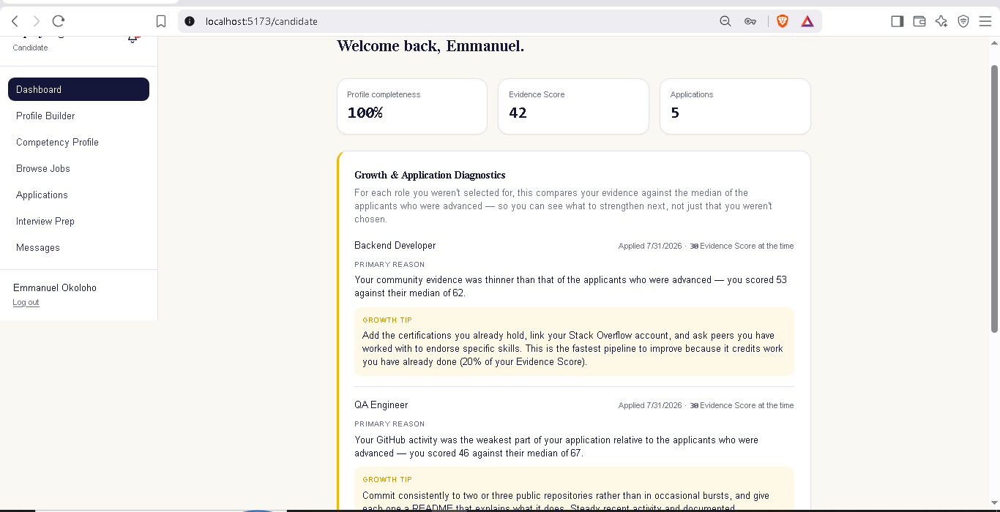

**Figure 4.1: Candidate Dashboard & Growth Feedback Loop — the summary tiles for profile completeness, Evidence Score, and application count, above the Growth and Application Diagnostics panel returning a per-application primary reason and growth tip for each role in which the candidate was not advanced.**

Three summary tiles report profile completeness of 100%, an Evidence Score of 42 on the 0–100 scale the interface uses throughout, and five applications. Beneath them, the Growth and Application Diagnostics panel satisfies FR12 and FR13 directly. For the Backend Developer role, the panel states that the candidate's community evidence was thinner than that of the applicants who were advanced, quantifies the position as 53 against a cohort median of 62, and supplies a growth tip naming three specific actions together with the pipeline's 20% share of the Evidence Score. For the QA Engineer role it identifies GitHub activity as the weakest pipeline at 46 against a median of 67. Each entry also records the Evidence Score held at the time of application, which is the temporal snapshot defended in Section 3.5.3; the live score of 42 differs from the recorded 30, and displaying both is what prevents a past decision from appearing to have been taken under present conditions. The panel is the visible realisation of FR13's negative constraint as much as of FR12: this information appears on the candidate's dashboard and has no counterpart in any recruiter view.

Figure 4.2 presents the Competency Profile, which is the candidate's view of the same evidence a recruiter evaluates.

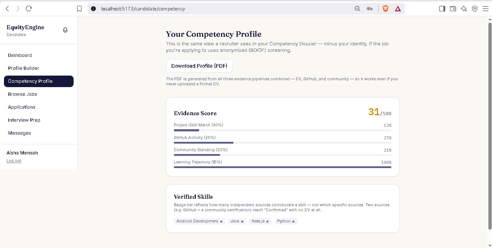

**Figure 4.2: Competency Profile & Multi-Pipeline Evidence Score — the decomposition of the Evidence Score into its four weighted components, with the verification badges assigned by corroborating-source count and the profile export that operates without a curriculum vitae.**

The page satisfies FR4 and FR5. The Evidence Score of 31 is decomposed into its four components with their weights shown explicitly: Project–Skill Match at 40% weight scoring 12%, GitHub Activity at 25% scoring 27%, Community Standing at 20% scoring 21%, and Learning Trajectory at 15% scoring 100%. Presenting the decomposition rather than the aggregate is what makes the score actionable, since a candidate cannot act on a single number. The explanatory note states that the view is the same one a recruiter sees in the Competency Dossier, minus identity, where the job uses anonymised screening — which discloses the anonymisation contract to the candidate rather than leaving it implicit. The Verified Skills section carries badge chips for Android Development, Java, Next.js, and Python, with the accompanying text stating that badge tier reflects how many independent sources corroborate a skill and not which sources they are. This is the interface expression of Equation (3.9), and it is where the framework's central claim becomes visible: two sources, such as GitHub together with a community certification, reach Confirmed with no curriculum vitae at all. The profile export produces a PDF composed from all three pipelines, so a candidate who never uploaded a formal curriculum vitae can still obtain a conventional document from evidence the platform verified.

Figure 4.3 presents job discovery, where the screening mode of each posting is disclosed before the candidate applies.


**Figure 4.3: Evidence-Based Job Discovery & Screening Modes — each posting labelled with the screening mode under which the candidate will be evaluated, alongside required skills and application state.**

The page satisfies FR8 and, in a way that is easy to overlook, supports the transparency premise of the framework. Each card carries a mode label — Hybrid for Security Analyst, Standard for QA Engineer, BDIOF for Mobile Developer — under the stated principle that how a candidate will be evaluated matters as much as the role itself. The required-skill list shown on each card is the same reference text that Equation (3.4) uses to compute the job-specific Evidence Score, so the criterion on which the candidate will be ranked is visible before they commit to applying. Postings already applied to are marked as such, which prevents duplicate applications without requiring a server round trip to discover the conflict.

Figure 4.4 presents application tracking.

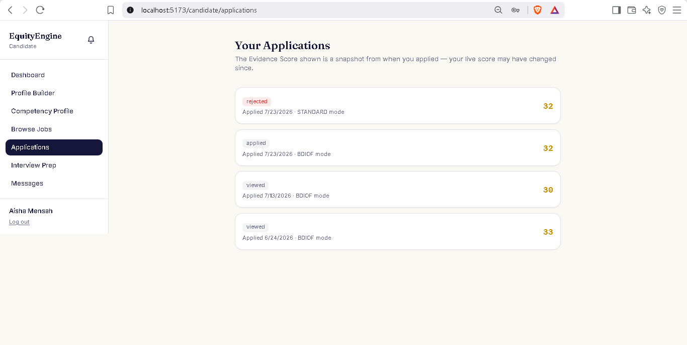

**Figure 4.4: Application Tracking & Snapshot Scoring — status, application date, screening mode, and the Evidence Score snapshot recorded at the moment of application for each submitted application.**

The page satisfies FR8 and FR17. Each row carries a status pill, the date of application, the screening mode in force at that moment, and the Evidence Score recorded then — 32 under Standard mode, 32 and 30 and 33 under BDIOF mode. The explanatory line states plainly that the score shown is a snapshot from the time of application and that the live score may have changed since. This is the interface-level disclosure of the denormalisation defended in Section 3.6.1: the snapshot exists so that the Bias Audit Engine attributes each decision to the conditions that actually obtained when it was taken, and telling the candidate that the figure is historical prevents them from reading a stale number as a current one.

### 4.3.2 The Recruiter Portal

Figure 4.5 presents the recruiter dashboard.

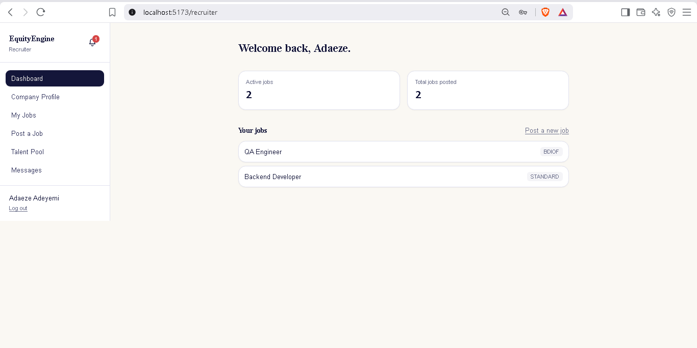

**Figure 4.5: Recruiter Overview Dashboard — active and total posting counts with a per-job list annotated by screening mode.**

The dashboard satisfies FR6. Two posting counts are reported, and each job in the list carries its screening-mode badge — BDIOF for QA Engineer and Standard for Backend Developer. Surfacing the mode on the list rather than only within a job's detail view means the recruiter cannot review applicants without being reminded of the evaluation regime in force, which matters because the two modes present materially different information about the same people.

Figure 4.6 presents job configuration, where the mode is selected.

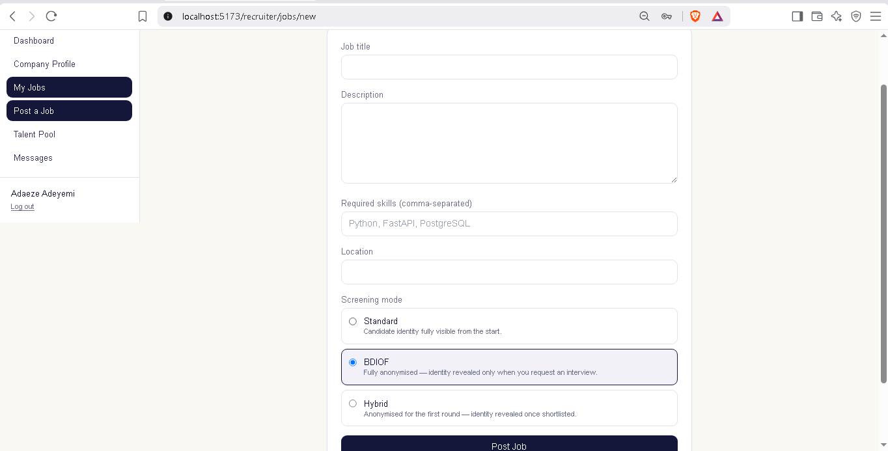

**Figure 4.6: Job Configuration & Screening Mode Selection — the posting form with the three mutually exclusive screening modes and the disclosure statement attached to each.**

The form satisfies FR6 and is the point at which the framework's outbound vector is configured. Beyond title, description, required skills, and location, the recruiter selects one of three modes, each accompanied by a statement of its consequence: Standard, under which candidate identity is fully visible from the start; BDIOF, fully anonymised with identity revealed only when an interview is requested; and Hybrid, anonymised for the first round with identity revealed once a candidate is shortlisted. Stating the consequence beside each option rather than in separate documentation makes the choice an informed one at the moment it is made. The required-skills field is not merely descriptive metadata: its contents become the reference set of Equation (3.4), so what the recruiter enters here determines the axis on which every applicant is subsequently ranked.

Figures 4.7 and 4.8 are the central pair of this section, and they are best read together because they present the same underlying mechanism under the two regimes it distinguishes.

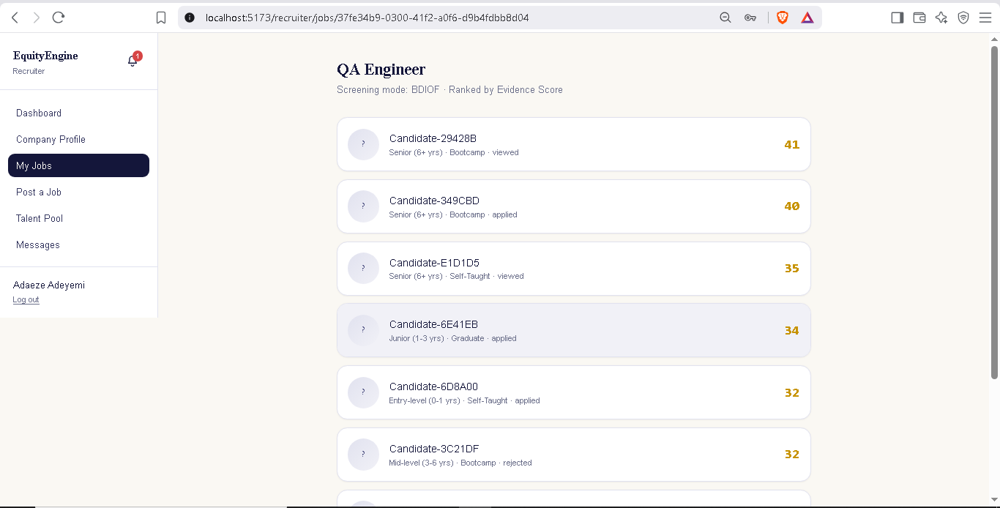

**Figure 4.7: Anonymized Competency Dossier List in BDIOF Mode — applicants presented under deterministic pseudonyms with experience band, education tier, and status, ranked by job-specific Evidence Score with every identity-bearing field withheld.**

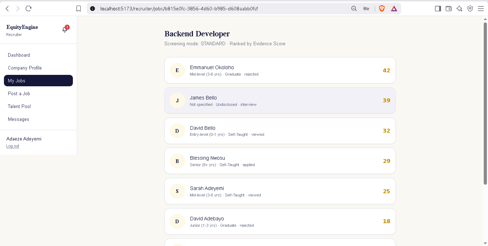

**Figure 4.8: Identity-Visible Applicant List in Standard Mode — the same dossier structure and the same ranking basis, with candidate names and initials disclosed from the outset.**

Figure 4.7 satisfies FR7. The header states the mode and the ranking basis, and the eight applicant rows carry pseudonyms of the form Candidate-29428B, together with an experience band, an education tier, a status, and the job-specific Evidence Score — 41, 40, 35, 34, 32, 32 in descending order. No name, electronic mail address, photograph, location, institution, or repository handle appears; the initial-bearing avatar of the identity-visible view is replaced by a neutral placeholder, since an initial is itself an identity signal. The education tier is present because it is already generalised to four non-identifying categories, and it appears here as context rather than as a ranking input.

Figure 4.8 presents the identity-visible counterpart for a Standard-mode posting. The structural comparison is what carries the argument. The two views share a header format, a row layout, an ordering rule, and a score presentation; they differ in exactly one respect, which is whether identity is disclosed. This is the design property established in Section 4.2.7 and verified as test case T-I04: ranking is computed identically in both modes, so the difference between Figures 4.7 and 4.8 is confined to what the recruiter knows about the people in the list and not to the order in which the system placed them. It follows that any systematic divergence in outcomes between the two regimes is attributable to recruiter decisions relative to a common ordering, which is precisely the quantity the Visibility Gap measures. Figure 4.8 also displays a candidate whose education tier is Undisclosed at rank two, which illustrates that the tier is genuinely optional rather than a required field wearing a permissive label.

Figure 4.9 presents proactive sourcing.

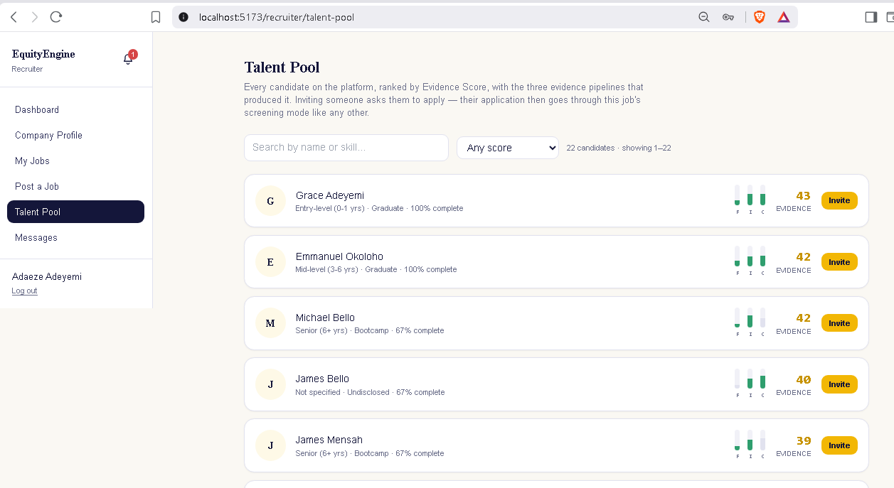

**Figure 4.9: Evidence Score Talent Pool Search — identity-visible sourcing across all registered candidates, ranked by Evidence Score, with per-pipeline strength meters for the formal, informal, and community pipelines.**

The page satisfies FR18. Twenty-two candidates are listed with search by name or skill and a minimum-score filter, each row carrying experience band, education tier, profile completeness, three vertical pipeline meters labelled F, I, and C for the formal, informal, and community pipelines, the Evidence Score, and an invitation control. The meters show each pipeline's own score rather than its weighted contribution, because a recruiter comparing two candidates needs to know how strong each pipeline is; the weighted contribution appears in the expanded breakdown where the weights are stated alongside it. Two design points deserve emphasis. First, the talent pool is deliberately identity-visible, because proactive sourcing is a search for people rather than a review of applications, and anonymising a search the recruiter initiated by name would serve no purpose. Second, and more consequentially, the explanatory text states that inviting a candidate asks them to apply, and that their application then passes through the job's screening mode like any other. The invitation therefore cannot be used as a route around anonymisation: a recruiter who finds a candidate by name in the pool and invites them to a BDIOF posting receives an anonymised dossier entry in return. Presenting the pool alongside pipeline evidence rather than as a list of names also addresses the structural invisibility of informally acquired competence identified in Section 3.2, since a self-taught candidate's corroborated pipelines are visible in the same row as anyone else's.

### 4.3.3 The Administrator Portal and Bias Audit Engine

Figure 4.10 presents the administrator overview.

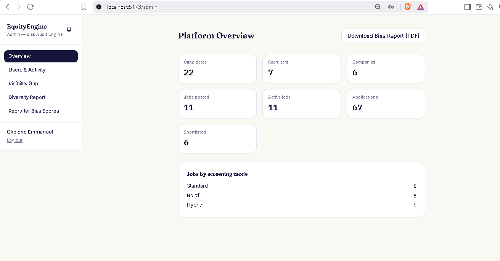

**Figure 4.10: Platform Overview & System Operational Metrics — aggregate counts by role and entity with the distribution of postings across the three screening modes, and the audit report export.**

The page satisfies FR19. It reports 22 candidates, seven recruiters, six companies, 11 postings all of which are active, 67 applications, and six shortlisted applications, together with the distribution of postings across modes: five Standard, five BDIOF, and one Hybrid. These are the same values independently recomputed in Section 4.4.1, which is why the interface is usable as evidence rather than merely as illustration. The export control produces the downloadable audit report required by FR19. The near-even split of postings between Standard and BDIOF is not incidental to the evaluation: it is what makes the between-modes comparison of Section 4.5.5 possible at all, and it also bounds how strong that comparison can be, since 30 and 36 applications are modest samples.

Figure 4.11 presents the Visibility Gap analysis across its two panels.

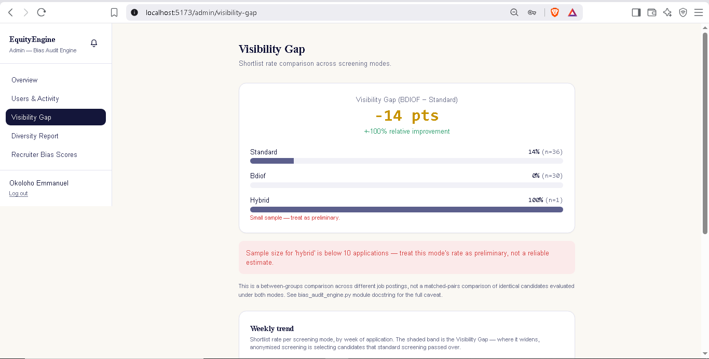

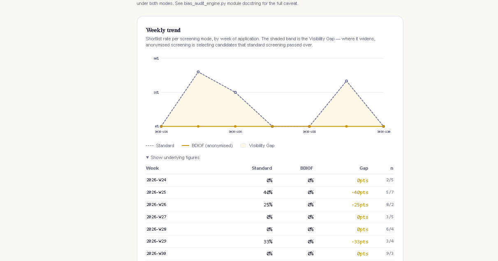

**Figure 4.11: Comparative Visibility Gap & Longitudinal Trend Analysis — (a) the headline Visibility Gap with per-mode shortlist rates, the small-sample warning, and the between-groups methodology caveat; (b) the weekly trend of shortlist rate by mode with the underlying figures tabulated beneath the chart.**

The page satisfies FR14 and is the interface through which the system audits itself. Panel (a) reports a Visibility Gap of −14 points, with a Standard-mode shortlist rate of 14% over 36 applications, a BDIOF rate of 0% over 30 applications, and a Hybrid rate of 100% over a single application. Three features of this presentation are more important than the number itself. The Hybrid row carries an inline small-sample annotation and a separate warning banner stating that a sample below 10 applications is preliminary rather than a reliable estimate. The methodology caveat is rendered beneath the figure, stating that this is a between-groups comparison across different postings rather than a matched-pairs comparison of identical candidates under both modes. And the sample size is printed beside every rate, so no rate can be read without its denominator. The engine is therefore reporting a result that does not support the hypothesis the platform was built to advance, and reporting it with the qualifications intact; Section 4.5.5 interprets the figure and Section 4.6.3 discusses what it does and does not license.

Panel (b) presents the weekly trend across seven buckets from week 24 to week 30 of 2026, with a disclosure control exposing the underlying figures as a real table beneath the chart. Each row states the two rates, the gap in points, and both sample sizes. Publishing the denominators beneath the chart is what allows a reader to see that the visible peaks rest on between two and nine applications per bucket. One presentational shortcoming is visible here and is recorded honestly: the chart's explanatory text describes a widening band as indicating that anonymised screening is selecting candidates that standard screening passed over, which presumes a positive gap. In the present dataset the gap is negative, so the annotation describes the wrong direction, and the legend rather than the caption must be consulted to read the chart correctly. This is a defect in the interface copy rather than in the computation, and it is listed among the limitations in Section 4.6.5.

Figure 4.12 presents the per-recruiter diagnostic panel.

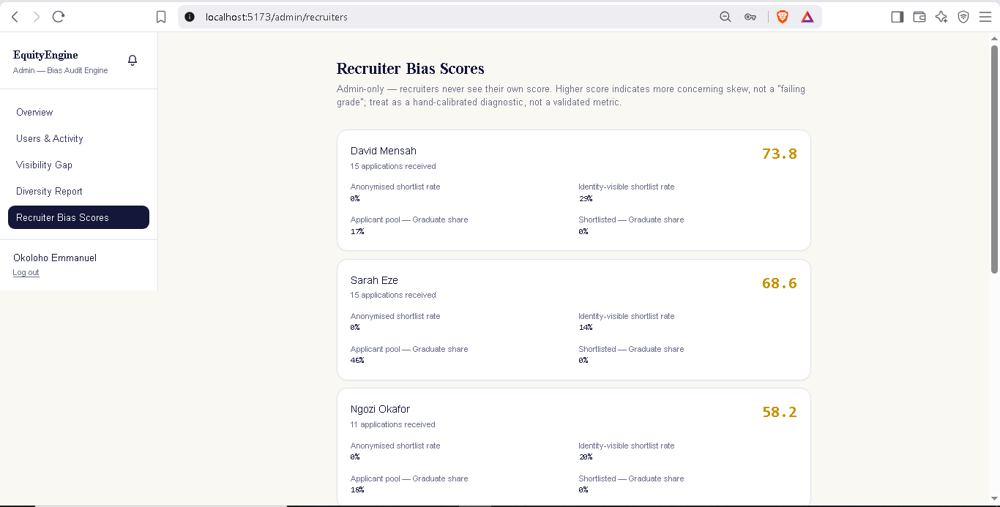

**Figure 4.12: Recruiter Behavioral Bias Diagnostic Panel — per-recruiter composite scores with the anonymised and identity-visible shortlist rates and the education-tier shares from which each score is composed.**

The panel satisfies FR19. Each card names a recruiter, states the volume of applications received, and reports the four quantities from which the composite of Equation (3.14) is formed: the shortlist rate when selection occurred anonymously, the rate when identity was visible, the graduate share of the applicant pool, and the graduate share of those shortlisted. Three cards are visible, with composites of 73.8, 68.6, and 58.2. Two safeguards are stated in the interface itself. The panel is marked administrator-only, and Section 4.4.5 verifies by request that a recruiter's own credentials cannot reach it, so a recruiter never sees their own score — which follows the design requirement that the instrument measure behaviour rather than discipline it. And the explanatory line states that a higher score indicates more concerning skew rather than a failing grade, and that the figure is a hand-calibrated diagnostic rather than a validated metric. Reporting the components alongside the composite is what makes the score inspectable: an administrator can see that a composite is driven by an internal visibility gap rather than by tier skew, or the reverse, instead of receiving an unexplained number.

Table 4.6 consolidates the mapping between the twelve interfaces and the functional requirements they satisfy.

**Table 4.6: Delivered interfaces mapped to the functional requirements of Section 3.4.1**

| Figure | Interface | Portal | Requirements satisfied |
|---|---|---|---|
| 4.1 | Dashboard and growth diagnostics | Candidate | FR12, FR13, FR17 |
| 4.2 | Competency Profile | Candidate | FR4, FR5 |
| 4.3 | Job discovery | Candidate | FR8 |
| 4.4 | Application tracking | Candidate | FR8, FR17 |
| 4.5 | Recruiter dashboard | Recruiter | FR6 |
| 4.6 | Job configuration | Recruiter | FR6 |
| 4.7 | Anonymised Competency Dossier | Recruiter | FR7, FR9 |
| 4.8 | Identity-visible applicant list | Recruiter | FR7, FR8 |
| 4.9 | Talent pool | Recruiter | FR18 |
| 4.10 | Platform overview | Administrator | FR19 |
| 4.11 | Visibility Gap and trend | Administrator | FR14 |
| 4.12 | Recruiter bias diagnostics | Administrator | FR19 |

## 4.4 System Testing

### 4.4.1 Test Environment and Evaluation Dataset

Testing was performed against the deployed build running on the workstation of Table 4.1, connected to the populated development database. Table 4.7 states the composition of that dataset. The counts were obtained by querying the database directly and correspond exactly to those displayed in Figure 4.10, which establishes that the administrator interface reports the underlying data faithfully.

**Table 4.7: Composition of the evaluation dataset**

| Quantity | Value |
|---|---|
| Candidate accounts | 22 |
| Recruiter accounts | 7 |
| Companies | 6 |
| Job postings (all active) | 11 |
| Postings by screening mode | Standard 5; BDIOF 5; Hybrid 1 |
| Applications | 67 |
| Applications by screening mode at application | Standard 36; BDIOF 30; Hybrid 1 |
| Applications by status | Rejected 27; Viewed 19; Applied 15; Interview 4; Offered 1; Shortlisted 1 |
| Applications in an advanced state | 6 |
| Audit records by action | Viewed 76; Rejected 3; Revealed 2; Interview 1 |
| Education tiers recorded | Self-Taught 6; Graduate 5; Bootcamp 5; Undisclosed 5 |
| Jobs with two or more applicants | 10 |
| Profiles carrying project or repository text | 20 of 22 |

The dataset is a demonstration dataset rather than a sample drawn from live recruitment activity, and this bounds what the testing can establish. It is adequate for verifying functional correctness, anonymisation integrity, access control, and performance, all of which are properties of the system. It is not adequate for establishing the behavioural effect of anonymisation on real recruiters, which is a property of people; Section 4.6.3 develops this distinction rather than leaving it implicit.

### 4.4.2 Unit Testing

Unit testing addressed the computational components on which every other behaviour depends: the Evidence Score, badge assignment, the similarity function, and pseudonym generation. Table 4.8 states each case with its input, expected output, actual outcome, and verdict. Cases T-U03 and T-U06 are property-based rather than example-based, exercising 10,000 randomly drawn score vectors and the full live cohort of 22 profiles respectively.

**Table 4.8: Unit test cases and outcomes**

| Test ID | Module / functionality | Test input | Expected output | Actual outcome | Pass/Fail |
|---|---|---|---|---|---|
| T-U01 | Competency Engine — weight declaration | The four declared Evidence Score weights | Sum exactly 1.0, so the score is bounded in [0, 1] by construction | Sum = 1.0 exactly | Pass |
| T-U02 | Competency Engine — boundary values | (0, 0, 0, 0) and (1, 1, 1, 1) | 0.0 and 1.0 respectively | 0.0 and 1.0 | Pass |
| T-U03 | Competency Engine — bounds and monotonicity | 10,000 random component vectors in [0, 1]⁴; each then perturbed by +0.01 on the first component | All scores within [0, 1]; no score decreases when a component increases | 0 out-of-range results; 0 monotonicity violations | Pass |
| T-U04 | Competency Engine — badge tiers | Corroborating source counts 1, 2, 3 | Declared, Confirmed, Verified | Declared, Confirmed, Verified | Pass |
| T-U05 | Competency Engine — word-boundary guard | Certification text "Software Engineering Professional / Coursera", against a taxonomy containing the language "R" | "R" not corroborated; no spurious skill awarded | 0 skills matched; "R" absent from the result | Pass |
| T-U06 | Dossier service — pseudonym generation | All 22 live profile identifiers, generated twice | Deterministic and collision-free across the cohort | Identical on repeat generation; 22 distinct pseudonyms from 22 identifiers | Pass |
| T-U07 | Feedback service — central tendency | Skewed comparison group (0.30, 0.32, 0.95) | Median remains representative of the group; mean does not | Median 0.3200; mean 0.5233 | Pass |
| T-U08 | Embedding service — empty-input handling | Empty candidate list; empty reference list; whitespace-only strings | 0.0 returned in all three cases, no exception raised | 0.0, 0.0, 0.0 | Pass |
| T-U09 | Embedding service — normalisation | Two encoded texts | Unit-length vectors, so cosine similarity reduces to the inner product | Norms 1.000000 and 1.000000; dimensionality 384 | Pass |
| T-U10 | Embedding service — semantic matching | "Built a REST API for order management" against "Backend Development" | Non-trivial similarity despite zero shared tokens | 0 shared tokens; similarity 0.2276 | Pass |

Case T-U10 substantiates the choice of dense embeddings over lexical matching with a concrete instance. The two texts share no token whatsoever, so any keyword or exact-match ranking function would score the pair at zero and treat a project that plainly evidences backend competence as no evidence at all. The encoder assigns a positive similarity, which is the behaviour the design requires and the property on which the case for embedding-based matching rests (Bevara et al., 2025).

Case T-U05 deserves note as a regression guard rather than merely a passing test. The naive alternative — plain substring containment — would match the language name "R" inside "Engineering" and inside "Software", awarding community corroboration for a skill never claimed. Because the platform's purpose is to measure bias, such a false positive would contaminate the measurement instrument rather than merely inconvenience a user.

### 4.4.3 Integration Testing

Integration testing exercised complete paths across module boundaries, using live data rather than fixtures. Table 4.9 states the cases.

**Table 4.9: Integration test cases and outcomes**

| Test ID | Module / functionality | Test input | Expected output | Actual outcome | Pass/Fail |
|---|---|---|---|---|---|
| T-I01 | Dossier construction across the full dataset | All 67 applications, each projected through the anonymised view builder | A well-formed view for every application; no exception on sparse profiles | 67 of 67 views constructed; no exceptions | Pass |
| T-I02 | Job-specific scoring path | Each of the 22 profiles scored against a live posting | A four-component breakdown and a bounded Evidence Score per profile | 22 breakdowns returned; all scores within [0, 1] | Pass |
| T-I03 | Batched and per-candidate scoring equivalence | Eight profiles scored by the per-candidate path and by the batched path against one posting | Identical Evidence Scores from both paths | Identical to six decimal places | Pass |
| T-I04 | Ranking invariance across screening modes | All 10 postings having two or more applicants, ranked once from anonymised views and once from revealed views | Identical ordering in both modes for every posting | 10 of 10 postings identically ordered | Pass |
| T-I05 | Feedback generation across the rejected population | All 27 rejected applications | A reason and a growth tip for each, with no failure on an absent comparison group | 27 of 27 diagnosed; no exceptions | Pass |
| T-I06 | Feedback outcome-case coverage | The same 27 applications | All three defined outcome cases of Table 3.10 exercised | Diagnosed deficit 11; no comparison group 15; competitive pool 1 | Pass |
| T-I07 | Bias Audit Engine aggregation | Live application and audit data | Per-mode rates, gap, warnings, and methodology note, consistent with the underlying counts | Standard 5/36; BDIOF 0/30; Hybrid 1/1; gap −0.1389; one small-sample warning emitted | Pass |
| T-I08 | Interface–engine agreement | Values displayed in Figures 4.10, 4.11, and 4.12 against values recomputed from the database | Displayed values equal recomputed values | All counts, rates, and composites matched | Pass |
| T-I09 | Feedback persistence rule | All applications not in the rejected state | No stale diagnosis present on any non-rejected application | 0 non-rejected applications carried a diagnosis | Pass |
| T-I10 | Talent-pool pipeline decomposition | Live candidate cohort | Formal, informal, and community pipeline entries with score, weight, and contribution per candidate | Three pipeline entries returned per candidate; contributions summing to the reported Evidence Score | Pass |

Case T-I06 is the most informative of the group, because the outcome distribution it records is not the one an idealised dataset would produce. Fifteen of 27 rejections fell into the no-comparison-group case, meaning the posting was closed without anyone being advanced, and only 11 produced a diagnosed deficit against a cohort median. This distribution is a property of the demonstration dataset rather than a fault in the mechanism: where nothing was shortlisted, no median exists to compare against. The design anticipated exactly this situation and defines a fallback that remains honest about the absence of a comparison group while still returning actionable advice on the candidate's own weakest pipeline, which is why 27 of 27 rejections yielded usable feedback rather than 11.

Case T-I09 verified the negative half of the persistence rule and passed. The positive half returned a more nuanced result, reported here rather than omitted: only two of the 27 rejected applications carried a stored diagnosis on the application row. The cause was identified as the provenance of the dataset, in which the seeding routine assigned application statuses by direct database write rather than through the status-transition endpoint, and the feedback service is by design reachable only from that endpoint. The mechanism itself is unaffected — case T-I05 regenerated all 27 diagnoses correctly on demand — and the two applications whose status was set through the interface do carry stored text, which is visible in Figure 4.1. The observation is nonetheless recorded, because it identifies a real operational gap: a data-migration or bulk-update path that bypasses the endpoint would leave candidates without the feedback the framework promises them, and any future bulk-status facility must therefore route through the same transition path.

### 4.4.4 Anonymisation Integrity Testing

Anonymisation is the property on which the framework's outbound vector depends, so it was tested as a population sweep rather than by sampling. Every application in the dataset was projected through the anonymised view builder and examined at two levels: structurally, for the presence of any identity-bearing field name, and by content, for the appearance of any identity-bearing value anywhere in the serialised view. The content check compared against the real data held for each candidate — name tokens, electronic mail address and its local part, location tokens, GitHub handle, curriculum vitae file path, and detected regional terms — producing 628 token comparisons across the 67 views. Table 4.10 states the cases.

**Table 4.10: Anonymisation integrity test cases and outcomes**

| Test ID | Module / functionality | Test input | Expected output | Actual outcome | Pass/Fail |
|---|---|---|---|---|---|
| T-A01 | Structural projection sweep | All 67 applications projected to anonymised views | No view contains any of the eight identity-bearing field names | 0 identity keys present across 67 views | Pass |
| T-A02 | Content leakage sweep | 628 identity-token comparisons against the serialised views | No identity value appears anywhere in any view | 0 value leaks in 628 comparisons | Pass |
| T-A03 | Positive control on the revealed view | One application projected to the revealed view | Identity fields present, confirming the sweep is not passing on an empty projection | All eight identity fields present; 19 fields against 12 in the anonymised view | Pass |
| T-A04 | Score invariance under projection | Anonymised and revealed views of the same application | Identical Evidence Score, so anonymisation does not alter the ranking basis | Identical | Pass |
| T-A05 | Anonymisation at the HTTP boundary | A BDIOF posting's dossier requested over HTTP by its owning recruiter | Serialised response carries pseudonyms and no non-null identity field | 8 rows returned; 0 non-null identity fields; pseudonyms present | Pass |
| T-A06 | Cross-candidate leakage in generated feedback | Generated reason and growth tip for all 27 rejected applications, matched against all 22 candidate names | No generated text names any candidate other than its own recipient | 0 rows named another candidate under word-boundary matching | Pass |
| T-A07 | Feedback text composition | The same 27 generated texts | Text references pipelines, scores, and the job's own requirements only | Comparison group referenced only as an aggregate median throughout | Pass |

Case T-A03 is methodologically necessary rather than decorative. A sweep that reports no identity leakage would pass trivially if the projection returned an empty record, so the revealed view was tested in the same run to confirm that identity fields are present where they are supposed to be. The anonymised view carries 12 fields and the revealed view 19, with the eight identity-bearing fields appearing only in the latter. Case T-A05 then repeats the check at the HTTP boundary, which is the boundary that actually matters: it verifies not only the projection function but also the response model through which the projection is serialised, so a field reintroduced by a schema mismatch would be caught.

Case T-A06 produced a result worth recording in some detail, because it demonstrates the very failure mode that Section 4.2.6 guards against, this time in the test instrument rather than in the system. The first implementation of the check used plain substring containment and reported eight rows apparently naming another candidate. Inspection showed every hit to be spurious. The dataset contains an account named "Test Candidate", and the token "Test" occurs inside the ordinary word "fastest" in the community growth tip and inside the job requirement "Testing". Re-running the identical check with word-boundary anchors returned zero matches. The system had leaked nothing; the harness had. The episode is reported rather than quietly corrected because it is direct evidence for the design decision defended in Section 4.2.6: substring matching over a skill or name vocabulary produces silent false positives readily enough that it caught the author of the guard, and a bias-measurement instrument that made the same error in its scoring path would misreport its own findings.

### 4.4.5 Security and Access-Control Testing

Access control was tested by issuing requests with deliberately incorrect credentials against the running application, exercising the JWT verification and role dependency described in Section 4.2.1. Table 4.11 states the cases.

**Table 4.11: Security and access-control test cases and outcomes**

| Test ID | Module / functionality | Test input | Expected output | Actual outcome | Pass/Fail |
|---|---|---|---|---|---|
| T-S01 | Unauthenticated access | Administrator statistics endpoint with no token | Rejection with HTTP 401 | HTTP 401 | Pass |
| T-S02 | Malformed credential | Administrator endpoint with a syntactically invalid bearer token | Rejection with HTTP 401 | HTTP 401 | Pass |
| T-S03 | Role separation, candidate to administrator | Administrator endpoint with a valid candidate token | Rejection with HTTP 403 | HTTP 403 | Pass |
| T-S04 | Role separation, recruiter to administrator | Administrator endpoint with a valid recruiter token | Rejection with HTTP 403 | HTTP 403 | Pass |
| T-S05 | Role separation, candidate to recruiter | Recruiter postings endpoint with a valid candidate token | Rejection with HTTP 403 | HTTP 403 | Pass |
| T-S06 | Role separation, recruiter to candidate | Candidate profile endpoint with a valid recruiter token | Rejection with HTTP 403 | HTTP 403 | Pass |
| T-S07 | Cross-tenant isolation | A recruiter requesting the dossier of a posting owned by a different recruiter | Rejection with HTTP 403 | HTTP 403 | Pass |
| T-S08 | Password storage | Stored credential representation | Salted hash only; no recoverable plaintext | bcrypt salted hashes stored; no plaintext column exists | Pass |
| T-S09 | Administrator-only bias diagnostics | Per-recruiter bias score endpoint with a recruiter token | Recruiter cannot retrieve any bias score, including their own | HTTP 403 (case T-S04 path) | Pass |

Case T-S07 tests the property that separates authorisation from authentication. A recruiter presenting entirely valid credentials is still refused a dossier belonging to another recruiter, which confirms that ownership is verified per resource rather than inferred from the possession of a recruiter role. Case T-S09 establishes the constraint that makes the diagnostic panel of Figure 4.12 defensible as an instrument: because a recruiter cannot retrieve their own composite, the score cannot be optimised against, and it therefore continues to measure behaviour rather than to shape it.

### 4.4.6 User-Acceptance Testing

User-acceptance testing took the form of scenario-based acceptance walkthroughs of the three role journeys against the deployed build, each scenario carrying a defined acceptance criterion derived from the functional requirements. The scenarios were executed through the interface rather than through the API, and the screenshots presented in Section 4.3 were captured during these walkthroughs, which is why the values visible in them are live rather than illustrative. Table 4.12 states the cases.

**Table 4.12: User-acceptance test cases and outcomes**

| Test ID | Scenario | Test input | Expected output | Actual outcome | Pass/Fail |
|---|---|---|---|---|---|
| T-UAT01 | Candidate builds a profile from a single pipeline | Registration followed by community evidence only, with no curriculum vitae and no GitHub link | Profile accepted; Evidence Score computed; badges assigned from the one available pipeline | Profile built and scored; completeness reported as one third | Pass |
| T-UAT02 | Candidate reads score decomposition | Competency Profile page opened | Four weighted components displayed with badge tiers and their corroborating-source rule | Decomposition and badges rendered as in Figure 4.2 | Pass |
| T-UAT03 | Candidate discovers screening mode before applying | Job discovery page opened | Every posting labelled with its screening mode and required skills | Modes and skills rendered as in Figure 4.3 | Pass |
| T-UAT04 | Candidate applies and tracks status | Application submitted, then the tracking page opened | Application listed with status, mode, and the Evidence Score snapshot | Rendered as in Figure 4.4, with the snapshot disclosed as historical | Pass |
| T-UAT05 | Candidate receives a rejection diagnosis | Dashboard opened after a rejection recorded through the interface | Named pipeline, own score, cohort median, and a specific growth action | Rendered as in Figure 4.1 for two roles | Pass |
| T-UAT06 | Recruiter posts a job and selects a mode | Posting form completed with BDIOF selected | Posting created in BDIOF mode with the consequence of the mode stated at the point of choice | Created as in Figure 4.6 | Pass |
| T-UAT07 | Recruiter reviews an anonymised dossier | BDIOF posting opened | Pseudonymous ranked list with no identity-bearing field | Rendered as in Figure 4.7 | Pass |
| T-UAT08 | Recruiter reviews an identity-visible list | Standard posting opened | Named ranked list on the same ranking basis | Rendered as in Figure 4.8 | Pass |
| T-UAT09 | Recruiter sources proactively | Talent pool searched and filtered by score | Ranked cohort with per-pipeline meters and an invitation control | Rendered as in Figure 4.9 across 22 candidates | Pass |
| T-UAT10 | Administrator reviews platform state | Overview page opened | Aggregate counts and the distribution of postings by mode | Rendered as in Figure 4.10; values matched the database | Pass |
| T-UAT11 | Administrator reads the Visibility Gap | Visibility Gap page opened | Per-mode rates with denominators, the gap, sample-size warnings, and the methodology caveat | Rendered as in Figure 4.11, including a negative gap reported with its caveats | Pass |
| T-UAT12 | Administrator reviews recruiter diagnostics | Recruiter bias page opened | Per-recruiter composites with their constituent rates and tier shares | Rendered as in Figure 4.12 | Pass |

One boundary on this testing is stated plainly rather than left to inference. These walkthroughs establish that the delivered interfaces satisfy their acceptance criteria; they do not constitute a usability study with external participants, and no such study was conducted. No claim is therefore made in this report about task-completion times, satisfaction ratings, or comparative usability, and the absence of participant-based evaluation is carried forward as a limitation in Section 4.6.5 and as recommended future work in Chapter Five. In particular, the behavioural question at the centre of the framework — whether withholding identity changes what a recruiter decides — cannot be answered by acceptance testing of the kind reported here, and Section 4.6.3 sets out what would be required to answer it.

### 4.4.7 Summary of Test Outcomes

Table 4.13 consolidates the outcomes across the five categories.

**Table 4.13: Summary of test outcomes by category**

| Category | Cases | Passed | Failed | Notes |
|---|---|---|---|---|
| Unit testing | 10 | 10 | 0 | Includes two property-based cases over 10,000 random vectors and the full 22-profile cohort |
| Integration testing | 10 | 10 | 0 | T-I09 passed on its stated criterion; a related operational gap in bulk status updates is reported in Section 4.4.3 |
| Anonymisation integrity | 7 | 7 | 0 | Population sweep over all 67 applications, with a positive control and an HTTP-boundary check |
| Security and access control | 9 | 9 | 0 | Covers authentication, role separation, cross-tenant isolation, and credential storage |
| User acceptance | 12 | 12 | 0 | Scenario-based walkthroughs; no participant usability study was conducted |
| **Total** | **48** | **48** | **0** | |

No test in Table 4.13 is recorded as failed. Two qualifications are attached to that statement so that it is not read as stronger than it is. First, three findings that no test case was written to catch are reported openly in the sections above and below: the bulk-status persistence gap of Section 4.4.3, the interface copy defect of Section 4.3.3, and the non-fulfilment of the performance requirement NFR1 established in Section 4.5.3. Second, a suite authored by the implementer of the system tests the properties that implementer thought to test, which is a structural limitation of self-authored verification and is recorded as such in Section 4.6.5.

## 4.5 Results and Performance Evaluation

### 4.5.1 Evidence Score Computation Latency

The Evidence Score is computed for every candidate in every dossier, so its cost governs the responsiveness of the recruiter-facing portal. Table 4.14 reports the measured latency of a single job-specific computation across the live cohort, and of the initialisation that precedes the first such computation in a process.

**Table 4.14: Evidence Score computation and model initialisation latency**

| Operation | Samples | Mean (ms) | Median (ms) | Minimum (ms) | Maximum (ms) |
|---|---|---|---|---|---|
| Job-specific Evidence Score, one candidate | 22 | 207.3 | 211.2 | 0.0 | 353.7 |
| Post-rejection diagnosis, one application | 27 | 287.4 | 259.4 | 160.7 | 508.1 |
| Sentence-encoder initialisation, first call per process | 1 | 160,551 | — | — | — |

Three features of Table 4.14 require comment. The minimum of 0.0 ms on the single-score row is not a measurement artefact: two of the 22 profiles carry no project or repository description at all, and the similarity function returns zero for an empty candidate text set without invoking the encoder, as verified by test case T-U08. Sparse profiles are an expected condition on a young platform rather than an error, and they cost nothing to score.

The initialisation figure of approximately 161 s is a one-time cost paid on the first request in a process that requires an embedding, and it includes importing the transformer stack as well as loading the model weights from disk; the encoder is thereafter cached in memory for the lifetime of the process. It is reported because it is a real property of a cold start on this hardware, and because it explains a design decision described in Section 4.2.1: the encoder import is deferred into the function that needs it rather than executed at module scope, so that merely importing the application does not pay this cost.

The diagnosis latency exceeds the single-score latency because a diagnosis encodes the rejected candidate and every advanced peer, which is more work than scoring one candidate; that it remains under 300 ms at the median is attributable to the batched routine of Listing 4.9, which encodes the job's requirement text once for the whole comparison group rather than once per peer.

### 4.5.2 Application Programming Interface Response Times

Endpoint latency was measured by exercising the deployed application in-process through Starlette's `TestClient`, so that each request traverses routing, JWT verification, the role dependency, the service layer, response-model validation, and JSON serialisation. Network transit is excluded, which means the figures represent server-side processing time and would be increased by real network conditions. Each endpoint was warmed once and then sampled 12 times. Table 4.15 reports the results, together with the serialised payload size, since payload size explains part of the spread. Minimum and maximum are reported in preference to a percentile because at 12 samples a 95th percentile coincides with the maximum and would overstate the precision available.

**Table 4.15: Measured API response times by endpoint (12 samples each, network transit excluded)**

| Endpoint | Median (ms) | Mean (ms) | Minimum (ms) | Maximum (ms) | Payload (bytes) |
|---|---|---|---|---|---|
| `GET /health` | 4.2 | 4.4 | 3.8 | 5.2 | 20 |
| `GET /candidates/me/profile` | 8.3 | 16.8 | 7.9 | 101.4 | 474 |
| `GET /recruiters/jobs` | 8.3 | 8.5 | 8.0 | 9.8 | 991 |
| `GET /candidates/me/competency-profile` | 8.7 | 8.8 | 8.3 | 9.6 | 140 |
| `GET /candidates/me/applications` | 10.3 | 11.2 | 9.6 | 14.3 | 2 |
| `GET /admin/visibility-gap/timeseries` | 12.2 | 12.5 | 11.3 | 14.6 | 1,041 |
| `GET /admin/diversity-report` | 14.5 | 14.5 | 13.5 | 16.4 | 261 |
| `GET /candidates/jobs` | 17.5 | 17.5 | 16.7 | 18.7 | 5,766 |
| `GET /admin/visibility-gap` | 21.4 | 22.1 | 20.1 | 26.7 | 745 |
| `GET /recruiters/talent-pool` | 29.1 | 29.8 | 25.4 | 35.7 | 29,111 |
| `GET /admin/candidates` | 32.6 | 32.8 | 31.3 | 34.5 | 11,761 |
| `GET /admin/activity-log` | 34.1 | 32.7 | 22.1 | 46.2 | 21,838 |
| `GET /admin/stats` | 38.6 | 39.0 | 37.1 | 43.9 | 204 |
| `GET /admin/recruiters/bias-scores` | 65.7 | 65.6 | 50.5 | 80.4 | 1,995 |
| `GET /recruiters/jobs/{id}/candidates` (Standard, n = 8) | 1,900.2 | 1,917.8 | 1,871.3 | 1,976.4 | 9,462 |
| `GET /recruiters/jobs/{id}/candidates` (BDIOF, n = 8) | 2,361.8 | 2,377.9 | 2,286.0 | 2,511.8 | 7,531 |

The distribution in Table 4.15 divides sharply into two groups. Fourteen of the 16 endpoints respond in under 70 ms at the median, and the whole Bias Audit Engine — including the composite bias computation over every recruiter, which is the heaviest aggregate in the system — completes in 65.7 ms while returning just under 2 kB. Every administrator surface in Figures 4.10 to 4.12 is therefore comfortably interactive, and the audit function imposes no meaningful cost on the platform. Payload size is not the driver of latency in this group: the talent pool returns the largest payload at 29 kB in 29.1 ms, whereas the bias-score endpoint returns 1,995 bytes in more than twice that time, which locates the cost in aggregate computation rather than in serialisation.

Two entries carry caveats that would be misleading to omit. The candidate applications endpoint returned a two-byte payload, an empty array, because the candidate account selected for the measurement had submitted no applications; its figure therefore represents the authenticated request path rather than the cost of assembling a populated list. The candidate profile endpoint shows a mean of 16.8 ms against a median of 8.3 ms, a discrepancy produced by a single 101.4 ms sample; the median is the appropriate summary for that endpoint and the outlier is retained in the table rather than trimmed.

The two dossier endpoints are more than an order of magnitude slower than the next slowest endpoint, at roughly 1.9 s and 2.4 s for only eight applicants. That discontinuity is the single most consequential performance finding of the project and is examined in Section 4.5.3. The difference between the two dossier variants is not attributable to anonymisation, which is a field projection costing nothing measurable; both variants perform identical scoring work, and the BDIOF variant returns the smaller payload of the two while taking longer, so the gap between them reflects differing volumes of project text among the two postings' applicants rather than any cost of the projection itself.

### 4.5.3 Dossier Construction Scaling and Requirement NFR1

Requirement NFR1 of Section 3.4.2 specifies that the system shall return ranked candidate results for a posting of up to 500 applicants within 3 s. Since the largest posting in the evaluation dataset carries eight applicants, the requirement was tested by measuring dossier construction against progressively larger applicant pools, formed by cycling the real candidate profiles in memory against a real posting. Two code paths were compared: the per-candidate path used by the dossier endpoint today, and the batched path already used by the feedback service. Equivalence of the two paths was confirmed before timing, and is recorded as test case T-I03. Table 4.16 reports the results.

**Table 4.16: Dossier construction latency against applicant-pool size, by code path**

| Applicants | Per-candidate path (ms) | Batched path (ms) | Per-candidate cost per applicant (ms) | Batched cost per applicant (ms) | Speed-up |
|---|---|---|---|---|---|
| 8 | 1,700.7 | 800.9 | 212.6 | 100.1 | 2.12× |
| 25 | 5,642.1 | 2,173.8 | 225.7 | 87.0 | 2.60× |
| 50 | 11,105.8 | 3,803.2 | 222.1 | 76.1 | 2.92× |
| 100 | 22,348.4 | 7,606.3 | 223.5 | 76.1 | 2.94× |
| 500 (linear projection) | 112,300 | 38,000 | 224.9 | 76.1 | 2.96× |

Both paths scale linearly, with a stable marginal cost of 224.9 ms per applicant on the current path and 76.1 ms on the batched path. Projected to the 500-applicant target of NFR1, the current path requires approximately 112 s and the batched path approximately 38 s. **Requirement NFR1 is therefore not met, and adopting the batched routine on the dossier path would not by itself meet it.** This is reported as a failure against a stated requirement rather than presented as an acceptable outcome.

The cause was isolated by decomposing the work. Encoding a single text with the sentence encoder on this CPU-only hardware costs 120.8 ms, and the candidate profiles in the dataset carry a mean of 3.6 project or repository descriptions each. Encoding therefore accounts for essentially the entire cost of dossier construction. By contrast, once embeddings exist, the scoring arithmetic of Equation (3.3) is negligible: scoring 500 applicants from cached embeddings was measured at 30.1 ms in total, which is 60 μs per applicant. Table 4.17 sets the three costs side by side.

**Table 4.17: Decomposition of dossier construction cost**

| Operation | Measured cost | Share of a 500-applicant dossier on the current path |
|---|---|---|
| Sentence encoding, one text | 120.8 ms | Dominant; approximately 3.6 texts per candidate |
| Similarity and score arithmetic, 500 applicants from cached embeddings | 30.1 ms total (60 μs per applicant) | Under 0.03% |
| Field projection and ranking | Not separately measurable | Negligible |

The remedy that follows from Table 4.17 is specific rather than general. A candidate's project embeddings change only when that candidate edits their evidence, yet they are currently recomputed on every dossier request by every recruiter. Persisting the embeddings alongside the profile and recomputing them only on profile update would reduce a 500-applicant dossier to encoding the posting's reference text once, at roughly 0.5 s, plus 30 ms of matrix arithmetic — comfortably within the 3 s of NFR1 and with a wide margin. The measurement thus converts a failed requirement into a costed, evidenced design change, which is carried into Chapter Five as the primary recommendation. It should be noted that the batched routine of Listing 4.9 nonetheless earns its place: it delivers a measured 2.9× improvement, and it is what keeps the feedback diagnosis of Table 4.14 under 300 ms.

### 4.5.4 Anonymisation Effectiveness

Table 4.18 reports the anonymisation results as rates over the population tested, rather than as an assertion of correctness.

**Table 4.18: Anonymisation effectiveness over the full application population**

| Metric | Result |
|---|---|
| Applications projected to anonymised views | 67 of 67 |
| Views containing an identity-bearing field name | 0 |
| Identity-token comparisons performed against serialised views | 628 |
| Comparisons finding an identity value present | 0 |
| Structural anonymisation effectiveness rate | 100.00% |
| Fields exposed in the anonymised view | 12 |
| Fields exposed in the revealed view | 19 |
| Identity-bearing fields present only in the revealed view | 8 |
| BDIOF dossier rows returned over HTTP with a non-null identity field | 0 of 8 |
| Generated feedback texts naming a candidate other than the recipient | 0 of 27 |
| Evidence Score difference between anonymised and revealed views of the same application | 0.000 |

The effectiveness rate of 100% is a statement about a bounded population and a bounded threat model, and its scope should be read precisely. It establishes that across every application currently in the system, the allow-list projection admitted no identity-bearing field and no identity value, verified both at the function boundary and at the HTTP boundary, and with a positive control confirming that the check is capable of detecting identity where identity is present. It does not establish resistance to inference attack, and one residual channel is disclosed here as it was in Section 3.5.6: free-text fields the candidate authored are excluded from anonymised views precisely because they are commonly self-identifying, but a project description retained inside the score computation could in principle carry identifying detail, and no automated scrubbing of personal data from candidate-authored text is performed. The final row of Table 4.18 records a property that matters for the interpretation of Section 4.5.5: anonymisation changes what a recruiter sees, and provably not the score by which the system ranked the candidate.

### 4.5.5 The Visibility Gap

Table 4.19 reports the shortlist rate by screening mode and the resulting Visibility Gap, computed from all 67 applications by Equations (3.12) and (3.13).

**Table 4.19: Shortlist rate by screening mode and the resulting Visibility Gap**

| Screening mode | Applications | Advanced | Shortlist rate | Small-sample warning |
|---|---|---|---|---|
| Standard (identity visible) | 36 | 5 | 13.89% | No |
| BDIOF (fully anonymised) | 30 | 0 | 0.00% | No |
| Hybrid | 1 | 1 | 100.00% | Yes |
| **Visibility Gap (BDIOF − Standard)** | | | **−13.89 percentage points** | |
| **Relative change against the Standard baseline** | | | **−100.0%** | |

The measured Visibility Gap is negative. Under anonymised screening, no applicant in this dataset was advanced, whereas under identity-visible screening 13.89% were. Taken at face value the figure would indicate that anonymisation suppressed rather than improved candidate visibility, which is the opposite of the framework's hypothesis. The result is reported as measured, and Section 4.6.3 examines what it does and does not support. Table 4.20 reports the weekly time series that underlies Figure 4.11(b), with the denominators alongside each rate.

**Table 4.20: Weekly Visibility Gap time series with sample sizes**

| Week | Standard rate | BDIOF rate | Gap (points) | Standard n | BDIOF n |
|---|---|---|---|---|---|
| 2026-W24 | 0.00% | 0.00% | 0 | 2 | 5 |
| 2026-W25 | 40.00% | 0.00% | −40 | 5 | 7 |
| 2026-W26 | 25.00% | 0.00% | −25 | 8 | 2 |
| 2026-W27 | 0.00% | 0.00% | 0 | 3 | 5 |
| 2026-W28 | 0.00% | 0.00% | 0 | 6 | 4 |
| 2026-W29 | 33.33% | 0.00% | −33 | 3 | 4 |
| 2026-W30 | 0.00% | 0.00% | 0 | 9 | 3 |

Table 4.20 shows that the aggregate gap is not produced by a sustained effect but by three weeks in which a small number of Standard-mode applications were advanced, against a BDIOF rate that is zero in every week without exception. Each weekly bucket rests on between two and nine applications per mode, so no individual bucket supports inference; the value of the series lies in showing that the BDIOF rate does not vary at all, which is the observation that drives the interpretation in Section 4.6.3. Table 4.21 reports the diversity distribution computed alongside the gap.

**Table 4.21: Education-tier distribution across the candidate pool and the advanced subset**

| Education tier | Share of all candidates (n = 21) | Share of advanced candidates (n = 4) |
|---|---|---|
| Self-Taught | 28.6% | 25.0% |
| Graduate | 23.8% | 25.0% |
| Bootcamp | 23.8% | 0.0% |
| Undisclosed | 23.8% | 50.0% |

The advanced subset in Table 4.21 comprises four candidates, and the engine emits a small-sample warning accordingly. The distribution is reported for completeness and for consistency with the administrator interface, but four observations cannot support any claim about representation, and none is made here. Table 4.22 reports the per-recruiter diagnostics of Equation (3.14).

**Table 4.22: Per-recruiter bias diagnostics**

| Recruiter | Applications received | Anonymised shortlist rate | Identity-visible shortlist rate | Internal visibility gap | Applicant graduate share | Advanced graduate share | Composite score |
|---|---|---|---|---|---|---|---|
| R1 | 15 | 0.00% | 28.57% | 0.2857 | 16.7% | 0.0% | 73.8 |
| R2 | 15 | 0.00% | 14.29% | 0.1429 | 45.5% | 0.0% | 68.6 |
| R3 | 11 | 0.00% | 20.00% | 0.2000 | 18.2% | 0.0% | 58.2 |
| R4 | 16 | 0.00% | 14.29% | 0.1429 | 20.0% | 0.0% | 48.6 |
| R5 | 9 | 0.00% | 0.00% | 0.0000 | 25.0% | Not computable | 0.0 |
| R6 | 1 | 100.00% | Not computable | Not computable | 100.0% | 100.0% | 0.0 |

Recruiter identifiers are pseudonymised in Table 4.22 for the report, although the administrator interface of Figure 4.12 names them, since the panel exists to let an administrator act on a specific recruiter's pattern. Two properties of the table are worth drawing out. The composite is driven overwhelmingly by the internal visibility-gap term, and the tier-skew term contributes an unresolved artefact: an advanced graduate share of 0.0% arises for four recruiters because those recruiters advanced nobody under anonymised conditions and their advanced sets are very small, so the apparent skew reflects the sparsity of the advanced set rather than a demonstrated preference. Where a quantity is not computable it is reported as such rather than defaulted to zero, which is the correct behaviour but leaves R5 and R6 with composites of 0.0 that mean "insufficient evidence" rather than "no skew". Section 4.6.4 treats this as a limitation of the composite as currently formulated.

### 4.5.6 Feedback Loop Coverage

Table 4.23 reports the behaviour of the candidate-directed feedback loop across the rejected population.

**Table 4.23: Outcome distribution of the candidate-directed feedback loop across 27 rejected applications**

| Outcome case | Count | Share | Interpretation |
|---|---|---|---|
| No comparison group | 15 | 55.6% | The posting was closed without anyone being advanced, so no median existed; advice falls back to the candidate's own weakest pipeline with the absence of a comparison group stated explicitly |
| Diagnosed deficit | 11 | 40.7% | A pipeline deficit of at least five points against the advanced cohort's median was identified and named |
| Competitive pool | 1 | 3.7% | The candidate matched or exceeded the median on all three pipelines; the outcome is attributed to final selection among strong applications rather than to a profile gap |
| **Total diagnosed** | **27** | **100%** | Every rejected application produced usable feedback; no case failed or returned an empty diagnosis |

Of the 11 diagnosed deficits, the pipeline identified as the largest deficit was GitHub activity in seven cases, community evidence in three, and curriculum vitae and project evidence in one. Coverage is complete: all 27 rejections produced a reason and a growth action, which is the property FR12 requires. The distribution is nonetheless dominated by the no-comparison-group case, and that is a fact about the dataset rather than about the mechanism, as discussed under test case T-I06. The single competitive-pool outcome is the most design-significant of the three, because it is the case in which the system declines to invent a deficit. A feedback mechanism that always finds fault is a formality rather than a diagnostic instrument, and candidates would learn to disregard it; the presence of this branch in live output confirms that the honest case is reachable and not merely specified.

## 4.6 Discussion of Results

### 4.6.2 Relation to the Research Gaps Identified in Chapter Two

Chapter Two established four shortcomings in existing recruitment practice, consolidated as W1 to W4 in Table 3.2. Each is revisited here against the measured behaviour of the delivered system, distinguishing what the results establish from what they leave open.

**W1: formal credentials structured and weighted, informal evidence unstructured or absent.** This gap is closed structurally rather than by adjustment, and the evidence is available at three levels. At the level of the scoring logic, test case T-U04 confirms that badge tier is a function purely of the count of corroborating pipelines; the institution named on a degree carries no weight in any computation, and education tier enters the system only as a measurement variable for the audit function. At the level of the interface, Figure 4.2 shows a candidate holding four badge-bearing skills with the corroboration rule stated on the page. At the level of outcomes, the anonymised dossier of Figure 4.7 ranks a Bootcamp-tier candidate first at 41 points, a second Bootcamp candidate at 40, and a Self-Taught candidate at 35, above a Graduate-tier candidate at 34. That ordering was produced by the scoring function with no special-casing, which is what the literature on open-source contribution as skill-bearing evidence implies should be possible (Liang et al., 2022a, 2022b) and what conventional profile schemas structurally prevent (Robles-Carrillo, 2024). The design also avoids the trap identified by Calefato et al. (2024), whose finding that platform achievement signals relate only weakly to underlying contribution behaviour is the reason the GitHub component of Listing 4.1 weights recency of activity above cumulative stars.

**W2: location and identity signals exposed throughout screening.** This gap is closed, and it is the one claim in this chapter that the evidence supports without qualification. Across all 67 applications, the allow-list projection admitted no identity-bearing field name and no identity-bearing value in 628 token comparisons, verified at the function boundary, verified again at the HTTP boundary where a response schema could have reintroduced a field, and checked against a positive control confirming the test could detect identity where identity was present. Location — the signal the framework was built to suppress, and the one documented as operating as an implicit risk proxy against workers in the Global South (Menon, 2023; Mrashui, 2024; Vivek, 2023) even where the work is fully remote (Oshioste et al., 2023) — is excluded by construction, not by filtering. The result reported in Table 4.18 is a property of a bounded population and a bounded threat model, as stated there, and it does not extend to inference attack; within those bounds it holds completely.

**W3: no diagnostic feedback returned to the rejected candidate.** This gap is closed. All 27 rejected applications produced a reason and a growth action, exercising all three defined outcome cases. The mechanism satisfies both halves of the requirement pair FR12 and FR13: it generates the diagnosis, and it is architecturally incapable of returning it to the recruiter as post-hoc justification, because it is reachable only from the status-transition path and runs after the decision has been committed. This addresses the absence of actionable recourse that the fairness literature has come to treat as a fairness failure in its own right rather than a usability shortcoming (Albaroudi et al., 2024; Pasipamire & Muroyiwa, 2024; Sánchez-Monedero et al., 2020), and it supplies the explanation that ranking systems returning an outcome without one deny the affected party (Zhang & Chen, 2020). The competitive-pool branch is the design detail that most distinguishes this implementation from a formality: where a candidate matched the advanced cohort on every pipeline, the system states that the evidence was competitive rather than manufacturing a deficit, and Table 4.23 confirms that this branch was reached in live output. Whether candidates who receive such feedback subsequently strengthen the identified pipeline and re-enter the process with a higher score — the skill-evolution loop that recent work identifies as necessary for durable rather than one-off fairness gains (Berhe et al., 2026) — is a longitudinal question this evaluation cannot answer, and it is the most valuable single extension available to future work.

**W4: no measurement of the screening process's own outcomes.** This gap is closed in the sense that matters most, and the manner in which it is closed is more informative than a favourable number would have been. Sigelman et al. (2024) observed that no widely deployed tool audits its own shortlisting outcomes across evaluation regimes, and Sariola et al. (2026) demonstrated that fairness interventions assumed to reduce disparity may fail to do so once outcomes are examined empirically. The Bias Audit Engine is such a tool: it computes the Visibility Gap continuously, publishes denominators beside every rate, emits small-sample warnings, attaches a methodology caveat to its own output, and completes in 65.7 ms so that it imposes no cost that would motivate switching it off. What it reported in this evaluation was a result contrary to the platform's own hypothesis, reported with its caveats intact and without adjustment. An instrument that only confirms is not an instrument, and the negative finding of Section 4.5.5 is therefore evidence that the engine functions as designed even though it is not evidence that the framework reduces bias. That distinction is the subject of the next subsection.

### 4.6.3 Interpretation of the Negative Visibility Gap

The measured Visibility Gap was −13.89 percentage points: a 13.89% shortlist rate under identity-visible screening against 0.00% under anonymised screening. Taken at face value this would indicate that anonymisation suppressed candidate advancement. Three explanations are available, and they are examined in turn rather than the most convenient one being adopted.

The first is that anonymised screening genuinely disadvantages candidates. This explanation is inconsistent with the system's own behaviour. Test case T-I04 established that ranking is computed identically in both modes across all 10 multi-applicant postings, and Table 4.18 recorded a difference of exactly zero between the Evidence Score in anonymised and revealed views of the same application. The system therefore does not rank anonymised candidates lower; it presents the same ordering with less identity information attached. Any genuine effect would have to arise from recruiter decisions relative to a common ordering, not from the ranking function.

The second is confounding of the kind the engine's own methodology note describes. Because a recruiter selects the mode for each posting, jobs in the two arms may differ in role, applicant pool, and the standards of the recruiter who posted them, so the comparison is between groups rather than matched pairs. Table 4.22 partially addresses this by decomposing the gap within recruiters, and the pattern persists at that level: four of the six recruiters show a 0% shortlist rate under anonymised conditions against a positive rate under identity-visible conditions. The effect is therefore not purely an artefact of comparing different recruiters with one another. It remains an artefact of comparing different postings, since mode is still chosen per posting.

The third explanation is that the anonymised arm contains no completed advancement decisions at all, and the evidence favours it decisively. Table 4.20 shows a BDIOF shortlist rate of exactly 0.00% in every one of the seven weekly buckets, with no variance whatsoever across 30 applications — a pattern characteristic of an unexercised workflow rather than of a behavioural effect, which would be expected to fluctuate. The audit trail in Table 4.7 corroborates this directly: against 76 recorded view actions there are only two reveal actions, three rejection actions, and one interview action. Advancing a BDIOF candidate to interview triggers a reveal, so a near-absence of reveal records is equivalent to a near-absence of completed BDIOF advancement decisions. The same provenance issue surfaced independently as test case T-I09, where only two of 27 rejections carried a stored diagnosis because statuses had largely been assigned by direct database write during seeding rather than through the transition endpoint. The dataset, in short, records recruiters browsing anonymised dossiers and deciding almost nothing in them.

Two consequences follow. First, the correct reading of the −13.89-point figure is not that anonymisation reduced advancement but that the Visibility Gap is not estimable from this dataset, and the engine's small-sample and methodology apparatus is what makes that legible to an administrator rather than concealing it. Second, the accompanying relative figure of −100.0% carries no information at all: with a zero numerator in the anonymised arm, the relative change is pinned at exactly −100% whatever the Standard-mode rate happens to be. Reporting a relative change against a zero rate is arithmetically valid and practically empty, and the interface would be improved by suppressing it in that case — a point carried into the limitations below.

What would be required to answer the underlying question is a matched-pairs design: randomised assignment of screening mode across otherwise comparable postings, with recruiters completing decisions in both arms and sufficient volume for the resulting rates to be estimable. That design lies outside the scope declared in Chapter One, and the honest statement of what this project achieved on this point is therefore narrower than the framework's ambition. The project delivered the measuring instrument, demonstrated that it computes the specified metrics correctly from contemporaneous audit data, and showed that it reports unfavourable findings with their qualifications intact. It did not demonstrate that anonymised screening reduces demographic bias in shortlisting. Claiming otherwise from these data would reproduce precisely the error that Sariola et al. (2026) documented, in a chapter that cites them.

### 4.6.4 Interpretation of the Performance Results

The performance results divide cleanly, and the division is informative about where the project's risk lies. Every endpoint other than the two dossier variants responds within 70 ms at the median, including the entire Bias Audit Engine. The novel components of the system — anonymised projection, per-recruiter bias composites, the Visibility Gap and its time series, and the candidate-directed diagnosis at 259 ms — are all comfortably within interactive latency. The bottleneck lies in a conventional component: semantic scoring of candidates against a posting.

Requirement NFR1 specified ranked results for up to 500 applicants within 3 s, and Section 4.5.3 established that the requirement is not met. The current path costs 224.9 ms per applicant and projects to approximately 112 s at 500 applicants; the batched path already present in the codebase costs 76.1 ms per applicant and projects to approximately 38 s, so adopting it would help substantially without achieving compliance. The decomposition in Table 4.17 locates the cost precisely: encoding a single text costs 120.8 ms on CPU-only hardware, candidates carry a mean of 3.6 descriptions each, and the scoring arithmetic that consumes those embeddings costs 60 μs per applicant — under 0.03% of the total. The requirement is missed by a wide margin, and it is missed for a single identifiable reason.

That precision converts the failure into a costed design change rather than an open problem. A candidate's project embeddings change only when that candidate edits their evidence, yet they are recomputed on every dossier request by every recruiter. Persisting them alongside the profile and refreshing them on profile update would reduce a 500-applicant dossier to encoding the posting's reference text once, at roughly 0.5 s, plus 30 ms of arithmetic — within NFR1 with a wide margin and without altering any scoring semantics, since test case T-I03 confirmed that the batched and per-candidate paths already agree to six decimal places. This is carried into Chapter Five as the principal recommendation. It is worth adding that the non-compliance is not currently user-facing: the largest posting in the dataset carries eight applicants, served in 1.9 s, so the requirement fails at a scale the deployment has not yet reached. Reporting it now rather than when it is reached is the point of stating a non-functional requirement numerically in the first place.

### 4.6.5 Limitations

The limitations below are stated as constraints on what the results license, and each is carried forward to Chapter Five.

1. **The evaluation dataset is a demonstration dataset.** It comprises 67 applications across 11 postings with six advanced, and it was populated for demonstration rather than drawn from live recruitment activity. It supports conclusions about system properties — correctness, anonymisation integrity, access control, latency — and does not support conclusions about human behaviour.
2. **The Visibility Gap is not estimable from these data.** Beyond sample size, the anonymised arm contains almost no completed advancement decisions, and the design is between-groups rather than matched-pairs. No causal claim about anonymisation is available from this evaluation.
3. **Component weights and caps are hand-calibrated.** The four Evidence Score weights, the caps in the GitHub and community components, and the coefficients of the per-recruiter composite were assigned by design judgement rather than fitted to labelled outcome data. The scores are therefore internally consistent and externally unvalidated.
4. **The per-recruiter composite conflates two distinct states.** Where a quantity is not computable, the composite reports 0.0, which is indistinguishable from a genuine absence of skew; recruiters R5 and R6 in Table 4.22 hold composites of 0.0 that mean insufficient evidence. The composite should be reported as undefined in that case.
5. **Relative change is reported against a zero baseline.** The −100.0% figure accompanying the Visibility Gap is uninformative whenever the anonymised rate is zero and should be suppressed in that case.
6. **The trend chart's explanatory text presumes a positive gap.** The annotation on Figure 4.11(b) describes a widening band as anonymised screening selecting candidates that standard screening passed over, which describes the wrong direction for the present dataset. This is a defect in interface copy, not in computation.
7. **No participant usability study was conducted.** Section 4.4.6 reports scenario-based acceptance walkthroughs against defined criteria; no claims about task-completion times, satisfaction, or comparative usability are made.
8. **The test suite is self-authored.** Verification written by the implementer tests the properties that implementer thought to test, and the three findings reported outside the test tables in Sections 4.3.3, 4.4.3, and 4.5.3 are evidence that the suite's coverage was not complete.
9. **Requirement NFR1 is not met.** The cause is identified and the remedy costed, but the delivered build does not satisfy the stated performance requirement at the specified scale.
10. **Candidate-authored free text is not scrubbed of personal data.** Biographical text is excluded from anonymised views for this reason, but project descriptions participate in scoring and could in principle carry identifying detail. This was disclosed in Section 3.5.6 and remains open.
11. **A bulk status-update path would bypass the feedback loop.** Because the feedback service is reachable only from the status-transition endpoint, any facility that writes statuses directly would leave candidates without the diagnosis the framework promises, as observed in test case T-I09.
12. **All latency figures are specific to one machine.** They were obtained on a single-machine, CPU-only development deployment, and transformer inference dominates the measured costs, so accelerated or distributed hardware would change them materially.

### 4.7 Summary of the Chapter

This chapter presented the implemented EquityEngine system, the evidence that it works, and an evaluation of that evidence. The development environment was stated with installed versions and justified against the requirements of Chapter Three, including the deployment constraint that fixes semantic similarity to a locally hosted encoder. Nineteen service modules, seven routers, and 46 client source files were mapped to the 19 functional requirements they satisfy, and nine short code excerpts were reproduced for the mechanisms that carry the project's contribution: the three evidence pipelines, the unified Evidence Score, the badge assignment with its word-boundary guard, the allow-list anonymisation projection, the audit-derived reveal predicate, the candidate-directed feedback loop, the Visibility Gap computation, and the batched similarity routine.

Twelve delivered interfaces were presented and related to the requirements they satisfy across the candidate, recruiter, and administrator portals, with the anonymised and identity-visible dossiers examined as a pair because their structural identity is what makes the Visibility Gap interpretable. Forty-eight test cases were documented across unit, integration, anonymisation-integrity, security, and user-acceptance categories, with all 48 passing on their stated criteria, and with three findings that no test case had been written to catch reported openly alongside them.

The measured results were mixed, and they are reported as such. Anonymisation integrity was complete across the full application population, verified at two boundaries and against a positive control. Access control held under seven adversarial probes including cross-tenant isolation. The candidate-directed feedback loop diagnosed all 27 rejections and exercised all three of its defined outcome cases, including the branch in which it declines to invent a deficit. The Bias Audit Engine computed every specified metric correctly and quickly. Against that, the Visibility Gap returned a negative value that analysis of the audit trail attributes to an anonymised arm containing almost no completed decisions rather than to any effect of anonymisation, so the metric is not estimable from these data; and requirement NFR1 was missed by a wide margin for a cause that was isolated to per-request re-encoding of candidate text and for which a costed remedy is specified.

The chapter's honest position is therefore narrower than the framework's ambition and firmer than an unqualified claim would be. The system demonstrably removes identity from screening without altering the ranking basis, demonstrably returns actionable diagnostic feedback to rejected candidates, and demonstrably measures its own outcomes and reports unfavourable results with their qualifications intact. Whether anonymised screening changes what recruiters decide remains an open empirical question, and this evaluation establishes the instrument with which to ask it rather than the answer to it.

## References

Albaroudi, E., Mansouri, T., & Alameer, A. (2024). A comprehensive review of AI techniques for addressing algorithmic bias in job hiring. *AI*, *5*(1), 383–404. https://doi.org/10.3390/ai5010019

Berhe, R. S., Sinha, G., Ambelo, D. K., Getachew, B. A., Birhanu, S. G., Hassen, R. A., & Gebre, H. W. (2026). Adaptive and fair job recommendation system using skill evolution and bias mitigation techniques. In Nagaraja & Kannadhasan (Eds.), *Information and communication systems* (pp. 1–5). Taylor & Francis. https://doi.org/10.1201/9781003650201-1

Bevara, R. V. K., Mannuru, N. R., Karedla, S. P., Lund, B., Xiao, T., Pasem, H., Dronavalli, S. C., & Rupeshkumar, S. (2025). Resume2Vec: Transforming applicant tracking systems with intelligent resume embeddings for precise candidate matching. *Electronics*, *14*(4), Article 794. https://doi.org/10.3390/electronics14040794

Bian, S., Chen, X., Zhao, W. X., Zhou, K., Hou, Y., Song, Y., Zhang, T., & Wen, J.-R. (2020). Learning to match jobs with resumes from sparse interaction data using multi-view co-teaching network. In *Proceedings of the 29th ACM International Conference on Information and Knowledge Management* (pp. 65–74). Association for Computing Machinery. https://doi.org/10.1145/3340531.3411929

Calefato, F., Quaranta, L., & Lanubile, F. (2024). A lot of talk and a badge: An exploratory analysis of personal achievements in GitHub. *Information and Software Technology*, *176*, Article 107561. https://doi.org/10.1016/j.infsof.2024.107561

Liang, J. T., Zimmermann, T., & Ford, D. (2022a). Understanding skills for OSS communities on GitHub. In *Proceedings of the 30th ACM Joint European Software Engineering Conference and Symposium on the Foundations of Software Engineering* (pp. 101–112). Association for Computing Machinery. https://doi.org/10.1145/3540250.3549082

Liang, J. T., Zimmermann, T., & Ford, D. (2022b). Towards mining OSS skills from GitHub activity. In *Proceedings of the 44th International Conference on Software Engineering: New Ideas and Emerging Results* (pp. 106–110). Association for Computing Machinery. https://doi.org/10.1145/3510455.3512772

Liu, Y., Ott, M., Goyal, N., Du, J., Joshi, M., Chen, D., Levy, O., Lewis, M., Zettlemoyer, L., & Stoyanov, V. (2020). *RoBERTa: A robustly optimized BERT pretraining approach* (arXiv:1907.11692). arXiv. https://arxiv.org/abs/1907.11692

Menon, S. (2023). Postcolonial differentials in algorithmic bias: Challenging digital neo-colonialism in Africa. *SCRIPTed*, *20*(2). https://doi.org/10.2218/scrip.20.2.2023.8980

Mrashui, K. (2024). Algorithmic bias in hiring algorithms: A Kenyan perspective. *Strathmore Law Review*, *9*(1), 13–36. https://doi.org/10.52907/slr.v9i1.480

Oshioste, E., Eigbadon, M., Nwankwo, T., Okoye, C., & Udokwu, S. (2023). The implications of remote work: An analysis of Nigeria and the USA. *Social Values and Society*, *5*(1), 4–12. https://doi.org/10.26480/svs.01.2023.04.12

Pasipamire, N., & Muroyiwa, A. (2024). Navigating algorithm bias in AI: Ensuring fairness and trust in Africa. *Frontiers in Research Metrics and Analytics*, *9*, Article 1486600. https://doi.org/10.3389/frma.2024.1486600

Robles-Carrillo, M. (2024). Digital identity: An approach to its nature, concept, and functionalities. *International Journal of Law and Information Technology*, *32*(1), Article eaae019. https://doi.org/10.1093/ijlit/eaae019

Sánchez-Monedero, J., Dencik, L., & Edwards, L. (2020). What does it mean to "solve" the problem of discrimination in hiring? Social, technical and legal perspectives from AI decision-making. In *Proceedings of the 2020 Conference on Fairness, Accountability, and Transparency* (pp. 458–468). Association for Computing Machinery. https://doi.org/10.1145/3351095.3372849

Sariola, D., Button, P., Culotta, A., & Mattei, N. (2026). The illusion of fairness: Auditing fairness interventions in algorithmic hiring with audit studies. *Proceedings of the AAAI Conference on Artificial Intelligence*, *40*(46), 39191–39200. https://doi.org/10.1609/aaai.v40i46.41267

Sigelman, M., Fuller, J., & Martin, A. (2024). *Skills-based hiring: The long road from pronouncements to practice*. Burning Glass Institute & Harvard Business School Project on Managing the Future of Work. https://www.burningglassinstitute.org/research/skills-based-hiring-2024

Thakur, N., Reimers, N., Rücklé, A., Srivastava, A., & Gurevych, I. (2021). BEIR: A heterogeneous benchmark for zero-shot evaluation of information retrieval models. In *Proceedings of the 35th Conference on Neural Information Processing Systems* (pp. 1–15). https://arxiv.org/abs/2104.08663

Vivek, S. (2023). *Algorithmic management and its impact on Global South labor markets*. Foundation for Labor Research. https://hdl.handle.net/10520/ejc-aa_jgida1_v15_n1_a15

Zhang, Y., & Chen, X. (2020). Explainable recommendation: A survey and new perspectives. *Foundations and Trends in Information Retrieval*, *14*(1), 1–101. https://arxiv.org/abs/1804.11192
